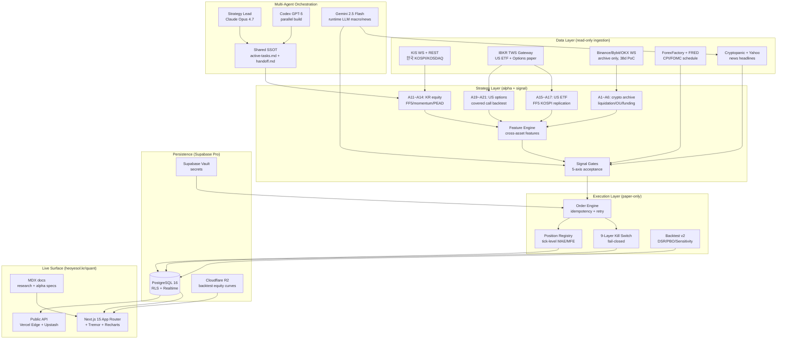
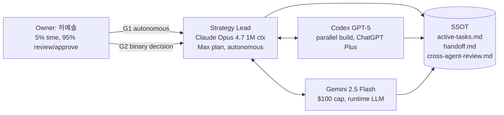
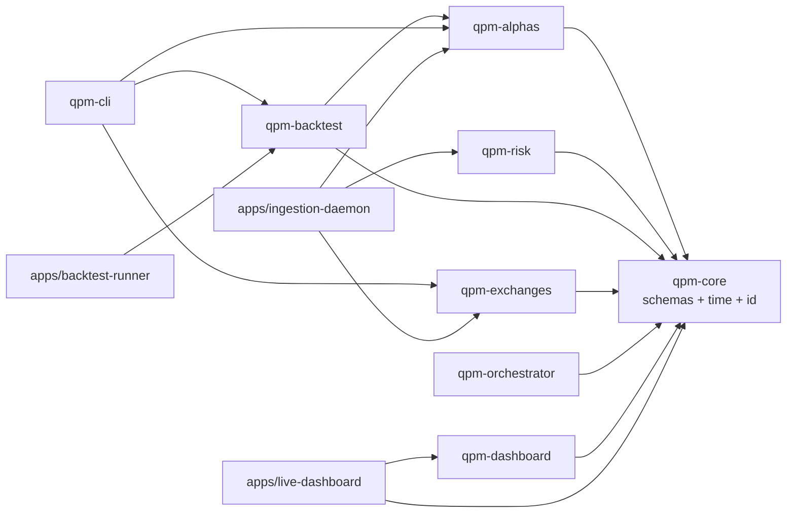
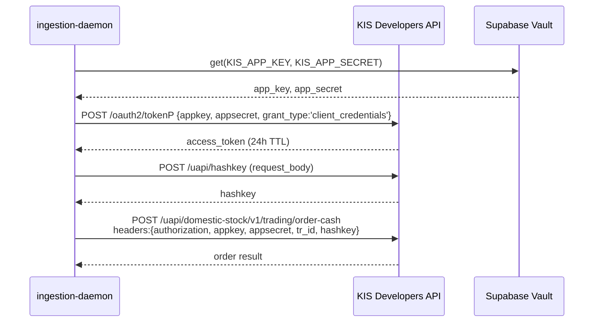
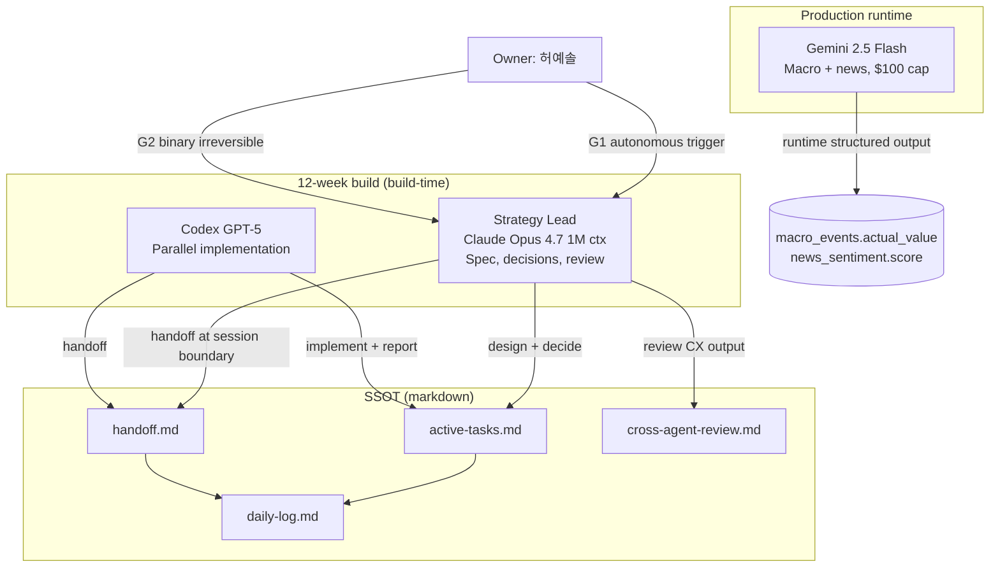
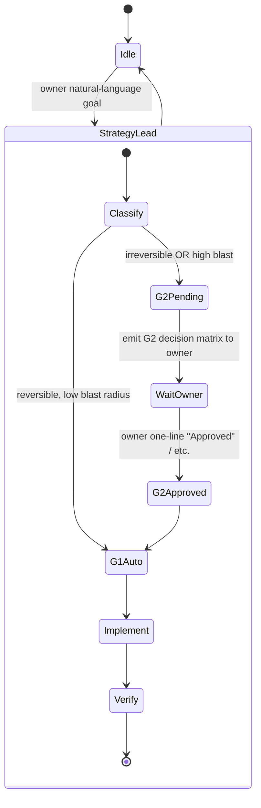

# 01 — System Architecture Specification

> **Project**: `quant-poc-multi-asset` (Yesol-Pilot, MIT)
> **Owner**: 허예솔 (Yesol-Pilot, AI-native PM)
> **Author**: Strategy Lead Claude Opus 4.7 (autonomous, Neo Genesis runtime)
> **Date**: 2026-05-14 KST
> **Status**: Design v1 (base for 12-week build)
> **Predecessor**: 38-day PoC (`v6~v11` ensemble, archived as honest failure documentation)
> **Sister docs**:
> - `docs/research/00-research-final-summary.md` (16-area research, ~65K words)
> - `docs/v11-ensemble/MASTER_DESIGN.md` (6-alpha ensemble, archived crypto-only PoC)
> - `docs/v11-ensemble/RISK_KILLSWITCH.md` (9-Layer Kill Switch, reused)
> - `docs/v11-ensemble/alpha-specs/` (A1~A6 crypto alpha specs, partially reused)

---

## Table of Contents

1. [System Architecture](#1-system-architecture) — High-level diagram + 3-layer + multi-agent
2. [Module Structure](#2-module-structure) — pnpm workspace + dual Python/Node tree
3. [Database Schema](#3-database-schema-supabase-pro) — 12 tables + RLS + indexes
4. [API Contract](#4-api-contract) — KIS / IBKR / Gemini / Crypto WS / Public API
5. [Multi-Agent Orchestration](#5-multi-agent-orchestration) — Claude / Codex / Gemini
6. [Tech Stack Detailed Choices](#6-tech-stack-detailed-choices-cold-honest) — Why each pick
7. [CI/CD + Testing](#7-cicd--testing) — GitHub Actions + Vitest + pytest
8. [Security + Secrets Management](#8-security--secrets-management) — Vault + Kill Switch + OWASP
9. [Observability](#9-observability) — OTel + Sentry + Vercel Analytics
10. [Cold Honest Trade-offs](#10-cold-honest-trade-offs) — Decision matrix per stack choice

---

## 1. System Architecture

### 1.1 Mission Statement (cold honest)

This is **not a production trading system**. It is a **portfolio asset** — a reproducible, transparent, multi-asset retail quant POC designed to:

- Document **honest failure** across 4 asset classes (KR equities / US ETF / US options / crypto archive).
- Provide **production-grade engineering** (9-Layer Kill Switch, DSR/PBO, multi-agent orchestration) reusable by any retail quant.
- Cross-link **NeurIPS 2026 #20237 (MARL Commitment Floors) + TMLR 2026 #8752 (Causal Safety)** academic work via shared infrastructure (multi-agent runtime, fail-closed safety).
- Anchor **5-dimensional excellence**: D1 Code (this spec) / D2 Academic (SSRN + ReScience) / D3 OSS (GitHub MIT) / D4 Live (`heoyesol.kr/quant`) / D5 Communication (Hacker News / Korean recruiter).

There is **no claim of alpha**. The 38-day PoC closure (WR 37.7%, PnL −15.1%, 191 trades, 0/108 A2 sweep cells passing) is preserved as a primary deliverable.

### 1.2 High-Level Architecture (Mermaid)



### 1.3 Three-Layer Logical Model

The codebase is organized along a strict **Data → Strategy → Execution** vertical, mirroring NautilusTrader / Backtrader conventions:

| Layer | Responsibility | Cardinality | Language |
|---|---|---|---|
| **L0 Data** | Ingest raw market/macro/news; normalize to canonical schema | 5 adapters (KIS / IBKR / Crypto / Macro / News) | Python (KIS, IBKR) + Node.js (Crypto, Macro, News) |
| **L1 Strategy** | Compute features; emit signals; apply acceptance gates | 21+ alphas + 1 feature engine + 5 gates | Python (backtest, ML) + Node.js (live signal) |
| **L2 Execution** | Idempotent order routing; tick-level MAE/MFE; Kill Switch | 1 router + 9 KS layers + 1 registry | Node.js (live) + Python (backtest sim) |
| **L3 Persistence** | Append-only ledger; idempotency keys; RLS | 12 tables | PostgreSQL (Supabase Pro) |
| **L4 Live Surface** | Public read of L3; rate-limited public API | 1 Next.js app + 1 API | TypeScript |
| **L5 Multi-Agent** | A2A handoff; SSOT; conflict resolution | 3 agents + 4 SSOT files | Markdown (NEO_MASTER_RULES.md) |

**Cold honest**: this layering is **strict at the type level** (Python `Pydantic` + TypeScript `zod`), **soft at the runtime level** (a single Node.js process can host both L0 ingestion and L1 signal emission). The strict layering matters for **reproducibility** (anyone can re-run L0 → L1 → L2 from scratch) more than for **performance**.

### 1.4 Multi-Agent Orchestration (Neo Genesis Runtime)

Build-time (12 weeks) uses three asymmetric agents:



- **Strategy Lead (Claude Opus 4.7)**: Spec authoring, decision matrix, autonomous G1 execution, cross-agent review. **No runtime cost** (Claude Max plan).
- **Codex (GPT-5)**: Parallel implementation of independent modules (e.g., A11 KR alpha while Strategy Lead implements A15 ETF alpha). **No runtime cost** (ChatGPT Plus).
- **Gemini 2.5 Flash**: Production runtime LLM only — macro event interpretation, news sentiment. Cost-capped at **$100 lifetime**. (Note: Gemini 2.0 Flash deprecated 2026-02-18, shutdown 2026-06-01 — design uses 2.5 Flash.)

**Conflict resolution**: Strategy Lead is final authority. Codex and Gemini emit recommendations, Strategy Lead consolidates in `cross-agent-review.md`. Owner receives **owner G2 decisions only when binary irreversible** (e.g., "submit SSRN paper?", "deploy to public production?").

### 1.5 Monorepo Strategy

**pnpm workspace + dual Python/Node.js**, single Git repo (`Yesol-Pilot/quant-poc-multi-asset`).

Why not split into multiple repos:
- 12-week solo build cannot afford context-switching across 8 repos.
- Cross-package references (Python backtest ↔ Node.js live signal) need shared canonical schema. Single repo = single source of types.
- External contributors (target 5–10 in 12 weeks) prefer single `git clone` over polyrepo onboarding.

Why not pure Python:
- Live page (`heoyesol.kr/quant`) is Next.js 15 (already owner's 11-SBU standard).
- Vercel Pro + Supabase Edge Functions are TypeScript-native.
- Real-time WebSocket orchestration (KIS WS, crypto WS replay) benefits from Node.js event-loop.

Why not pure Node.js:
- Backtest must use **Pandas + NumPy + scikit-learn + statsmodels** for DSR/PBO/cointegration. Node.js equivalents (`danfo.js`, `tfjs`) lag 3–5 years.
- Academic reproducibility (ReScience PR) requires Jupyter notebook artifacts — Python ecosystem.

**Decision**: `apps/*` (Next.js + Vercel) in TypeScript. `packages/qpm-*` in **either** Python or TypeScript per package, chosen by ecosystem fit. Cross-language IPC = JSON over stdin/stdout (`packages/qpm-orchestrator` spawns Python subprocesses for backtest).

---

## 2. Module Structure

### 2.1 Full Directory Tree

```
quant-poc-multi-asset/
├── README.md                          # English-first, 5-min quick start
├── README.ko.md                       # Korean expanded
├── ARCHITECTURE.md                    # → links to this file
├── CONTRIBUTING.md
├── CODE_OF_CONDUCT.md                 # Contributor Covenant v2.1
├── SECURITY.md                        # Disclaimer + report to dpthf1537@gmail.com
├── LICENSE                            # MIT, (c) 2026 Yesol Heo
├── CHANGELOG.md                       # Keep a Changelog 1.1
├── DISCLAIMER.md                      # NOT investment advice. Educational only.
├── pnpm-workspace.yaml
├── package.json                       # workspace root, dev deps only
├── pyproject.toml                     # poetry root, dev deps only
├── tsconfig.base.json
├── .nvmrc                             # node 20 LTS
├── .python-version                    # 3.11
├── .editorconfig
├── .gitignore
├── .gitattributes                     # line-ending consistency
│
├── packages/                          # internal, workspace:*
│   ├── qpm-core/                     # @qpm/core — shared types + schemas
│   │   ├── src/
│   │   │   ├── schemas/              # zod + pydantic dual
│   │   │   │   ├── alpha.ts          # AlphaSpec, SignalEvent
│   │   │   │   ├── alpha.py
│   │   │   │   ├── trade.ts          # PaperTrade, TradeLedger
│   │   │   │   ├── trade.py
│   │   │   │   └── risk.ts           # HaltEvent, KillSwitchLayer
│   │   │   ├── time/                 # KST timezone helpers
│   │   │   ├── id/                   # ULID + idempotency keys
│   │   │   └── env/                  # dotenv guard, secret redaction
│   │   ├── tests/
│   │   └── package.json
│   │
│   ├── qpm-alphas/                   # @qpm/alphas — 21+ alpha implementations
│   │   ├── src/
│   │   │   ├── kr-equity/            # A11~A14 (KIS)
│   │   │   │   ├── A11-ff5-kospi200.py
│   │   │   │   ├── A12-momentum-12-1.py
│   │   │   │   ├── A13-pead.py       # Post-Earnings Announcement Drift
│   │   │   │   └── A14-value-cap.py
│   │   │   ├── us-etf/               # A15~A17 (IBKR ETF)
│   │   │   │   ├── A15-ff5-replication.py
│   │   │   │   ├── A16-momentum-spy.py
│   │   │   │   └── A17-betting-against-beta.py
│   │   │   ├── us-options/           # A19~A21 (IBKR options paper)
│   │   │   │   ├── A19-covered-call.py
│   │   │   │   ├── A20-iv-rank-mean-revert.py
│   │   │   │   └── A21-earnings-straddle.py
│   │   │   ├── crypto-archive/       # A1~A6 (38-day PoC, archived)
│   │   │   │   ├── A1-liquidation-cascade.js
│   │   │   │   ├── A2-mean-revert-ou.js
│   │   │   │   ├── A3-extreme-funding.js
│   │   │   │   ├── A4-macro-event.js
│   │   │   │   ├── A5-funding-basis.js
│   │   │   │   └── A6-alt-mm.js
│   │   │   └── _registry.ts          # alpha lookup by id
│   │   ├── tests/
│   │   │   ├── unit/                 # per-alpha pure-function tests
│   │   │   └── golden/               # frozen-dataset regression
│   │   └── package.json
│   │
│   ├── qpm-risk/                     # @qpm/risk — 9-Layer Kill Switch
│   │   ├── src/
│   │   │   ├── layer1-hard-sl.ts     # exchange-side STOP_MARKET
│   │   │   ├── layer2-max-dd.ts      # 24h/7d/30d persistent halt
│   │   │   ├── layer3-correlation.ts # cross-asset cascade
│   │   │   ├── layer4-fail-closed.ts # WS/exchange offline
│   │   │   ├── layer5-flash-crash.ts # stress scenarios
│   │   │   ├── layer6-mmr.ts         # margin maintenance
│   │   │   ├── layer7-rate-limit.ts  # clock drift + rate cap
│   │   │   ├── layer8-news-veto.ts   # macro event veto
│   │   │   ├── layer9-manual.ts      # owner override
│   │   │   ├── halt-orchestrator.ts  # ordered halt: cancel → close → block
│   │   │   └── dispatcher.ts
│   │   ├── tests/
│   │   └── package.json
│   │
│   ├── qpm-backtest/                 # @qpm/backtest — DSR + PBO + sensitivity
│   │   ├── src/
│   │   │   ├── engine/               # tick-level event loop (Python)
│   │   │   ├── stats/
│   │   │   │   ├── dsr.py            # Deflated Sharpe Ratio (Bailey 2014)
│   │   │   │   ├── pbo.py            # Probability of Backtest Overfitting
│   │   │   │   ├── sensitivity.py    # parameter sweep
│   │   │   │   └── regime.py         # bull/bear/sideways breakdown
│   │   │   ├── fees/                 # KIS/IBKR/crypto fee schedules
│   │   │   ├── slippage/             # per-asset slippage models
│   │   │   └── reproducibility.py    # seed + checksum
│   │   ├── notebooks/                # Jupyter for academic appendix
│   │   ├── tests/
│   │   └── pyproject.toml
│   │
│   ├── qpm-exchanges/                # @qpm/exchanges — broker adapters
│   │   ├── src/
│   │   │   ├── kis/                  # 한국투자증권 KIS Developers
│   │   │   │   ├── auth.py           # OAuth + hashkey
│   │   │   │   ├── rest.py           # REST: order, quote, balance
│   │   │   │   ├── ws.py             # WS: real-time quote, execution
│   │   │   │   ├── rate-limit.py     # 20 RPS real / 5 RPS mock
│   │   │   │   └── errors.py         # EGW00201, EGW00121 mapping
│   │   │   ├── ibkr/                 # Interactive Brokers
│   │   │   │   ├── gateway.py        # ib_async (NOT ib_insync, deprecated)
│   │   │   │   ├── orders.py         # paper-only enforcer
│   │   │   │   ├── historical.py     # historical bars + options chain
│   │   │   │   └── port_7497.py      # paper gateway port enforcement
│   │   │   ├── crypto/               # archive only, read-only
│   │   │   │   ├── binance-ws.js
│   │   │   │   ├── bybit-ws.js
│   │   │   │   └── okx-ws.js
│   │   │   ├── macro/
│   │   │   │   ├── forexfactory.ts
│   │   │   │   └── fred.ts
│   │   │   └── news/
│   │   │       ├── cryptopanic.ts
│   │   │       └── yahoo-finance.ts
│   │   ├── tests/                    # contract tests against fixtures
│   │   └── package.json
│   │
│   ├── qpm-orchestrator/             # @qpm/orchestrator — multi-agent + LLM
│   │   ├── src/
│   │   │   ├── agents/
│   │   │   │   ├── strategy-lead.ts  # Claude Code subagent wiring
│   │   │   │   ├── codex.ts          # GPT-5 prompts (build time)
│   │   │   │   └── gemini.ts         # Gemini 2.5 Flash (runtime)
│   │   │   ├── runtime/
│   │   │   │   ├── macro-interpreter.ts  # Gemini: parse CPI/FOMC headlines
│   │   │   │   └── news-sentiment.ts     # Gemini: news polarity
│   │   │   ├── cost/
│   │   │   │   ├── budget-cap.ts     # hard $100 lifetime cap
│   │   │   │   └── token-counter.ts
│   │   │   └── ipc/                  # Python subprocess JSON I/O
│   │   ├── tests/
│   │   └── package.json
│   │
│   ├── qpm-dashboard/                # @qpm/dashboard — UI components shared by app
│   │   ├── src/
│   │   │   ├── charts/               # Tremor wrappers
│   │   │   │   ├── equity-curve.tsx
│   │   │   │   ├── alpha-grid.tsx
│   │   │   │   └── halt-timeline.tsx
│   │   │   ├── tables/
│   │   │   ├── theme/                # shadcn/ui tokens
│   │   │   └── realtime/             # Supabase subscription hooks
│   │   └── package.json
│   │
│   └── qpm-cli/                      # @qpm/cli — local dev CLI
│       ├── src/
│       │   ├── backtest.ts
│       │   ├── replay.ts             # crypto WS archive replay
│       │   └── seed.ts               # bootstrap fixtures
│       ├── tests/
│       └── package.json
│
├── apps/                              # deployable apps
│   ├── live-dashboard/               # Next.js 15 → heoyesol.kr/quant
│   │   ├── app/                      # App Router
│   │   │   ├── (public)/             # public routes
│   │   │   │   ├── page.tsx          # hero + 38d PoC overview
│   │   │   │   ├── alphas/[id]/page.tsx
│   │   │   │   ├── portfolio/page.tsx
│   │   │   │   ├── research/page.tsx # MDX index
│   │   │   │   ├── closure-note/page.tsx
│   │   │   │   └── disclaimer/page.tsx
│   │   │   ├── (docs)/               # MDX pages
│   │   │   │   ├── ko/               # 한국어
│   │   │   │   └── en/               # English
│   │   │   ├── api/                  # public API
│   │   │   │   ├── alphas/route.ts
│   │   │   │   ├── portfolio/state/route.ts
│   │   │   │   └── docs/openapi.yaml
│   │   │   ├── globals.css
│   │   │   ├── layout.tsx
│   │   │   ├── llms.txt              # static asset
│   │   │   ├── robots.txt
│   │   │   └── sitemap.ts
│   │   ├── lib/
│   │   │   ├── supabase/             # SSR + browser clients
│   │   │   └── ratelimit.ts          # Upstash + Vercel KV
│   │   ├── middleware.ts             # rate limit + auth
│   │   ├── next.config.mjs
│   │   ├── tailwind.config.ts
│   │   ├── vercel.json
│   │   └── package.json
│   │
│   ├── ingestion-daemon/             # long-running Node.js (paper KIS/IBKR feed)
│   │   ├── src/
│   │   │   ├── kis-feed.ts
│   │   │   ├── ibkr-feed.ts
│   │   │   ├── crypto-replay.ts      # archive replay only
│   │   │   └── persist.ts
│   │   ├── Dockerfile
│   │   └── package.json
│   │
│   └── backtest-runner/              # Python batch job (manual + CI)
│       ├── runner.py
│       ├── notebooks/                # Jupyter for academic appendix
│       ├── Dockerfile
│       └── pyproject.toml
│
├── docs/                              # static, served via Next.js app/(docs)
│   ├── research/                      # 16 research reports (~65K words)
│   ├── design/
│   │   ├── 00-design-index.md
│   │   ├── 01-architecture-spec.md   # ← this file
│   │   ├── 02-data-contracts.md      # pending
│   │   └── 03-test-strategy.md       # pending
│   ├── alpha-specs/                   # 21+ alpha specs (this design)
│   ├── runbooks/
│   │   ├── halt-recovery.md
│   │   ├── secret-rotation.md
│   │   └── disaster-recovery.md
│   ├── paper-draft/
│   │   ├── ssrn-paper-1/             # tex + bibtex
│   │   └── rescience-paper-2/        # FF5 KOSPI200 replication
│   └── README.md
│
├── notebooks/                         # global Jupyter (linked from packages)
│   ├── 01-ff5-kospi200-replication.ipynb
│   ├── 02-pead-korean-stocks.ipynb
│   └── 03-crypto-archive-analysis.ipynb
│
├── tests/                             # cross-package integration tests
│   ├── e2e/
│   ├── golden/                        # frozen datasets
│   └── adversarial/                   # prompt-injection + secret leak
│
├── .github/
│   ├── workflows/
│   │   ├── ci.yml                    # lint + typecheck + test + coverage
│   │   ├── backtest-regression.yml   # weekly cron
│   │   ├── release.yml               # semantic-release on tag
│   │   ├── dependabot-auto.yml
│   │   └── codeql.yml                # security scan
│   ├── ISSUE_TEMPLATE/
│   │   ├── bug_report.md
│   │   ├── feature_request.md
│   │   └── question.md
│   ├── pull_request_template.md
│   ├── dependabot.yml
│   └── FUNDING.yml                   # GitHub Sponsors + Polar.sh
│
├── docker/
│   ├── devcontainer/
│   │   └── Dockerfile
│   ├── ingestion-daemon.Dockerfile
│   └── docker-compose.yml             # local Supabase + Redis
│
├── scripts/
│   ├── seed-supabase.sql
│   ├── seed-supabase.ts
│   ├── rotate-secrets.sh
│   ├── verify-paper-only.sh           # hard guard: no live broker keys
│   └── replay-crypto-archive.ts
│
└── .vercel/
    └── project.json
```

### 2.2 Module Dependency Graph



**Hard rule**: `qpm-core` has **zero external deps** beyond zod / pydantic / dayjs / dateutil. Any other package may depend on `qpm-core`. Reverse dependency forbidden — enforced by `dependency-cruiser` in CI.

### 2.3 Mapping to 21+ Alphas

| Alpha ID | Asset Class | Module | Status (12-week build) |
|---|---|---|---|
| A1 Liquidation Cascade | crypto (archive) | `qpm-alphas/src/crypto-archive/A1-liquidation-cascade.js` | reuse 38d PoC code; freeze |
| A2 Mean Reversion OU | crypto (archive) | `qpm-alphas/src/crypto-archive/A2-mean-revert-ou.js` | archive with 0/108 sweep fail note |
| A3 Extreme Funding | crypto (archive) | `qpm-alphas/src/crypto-archive/A3-extreme-funding.js` | archive |
| A4 Macro Event Bracket | crypto (archive) | `qpm-alphas/src/crypto-archive/A4-macro-event.js` | archive; CPI/FOMC logic reused for KR/US |
| A5 Funding+Basis Harvest | crypto (archive) | `qpm-alphas/src/crypto-archive/A5-funding-basis.js` | archive |
| A6 Alt MM | crypto (archive) | `qpm-alphas/src/crypto-archive/A6-alt-mm.js` | archive scaffold (engine not implemented) |
| **A11 FF5 KOSPI200** | KR equity | `qpm-alphas/src/kr-equity/A11-ff5-kospi200.py` | **W2~W4 new build** |
| **A12 Momentum 12-1** | KR equity | `qpm-alphas/src/kr-equity/A12-momentum-12-1.py` | **W2~W4** |
| **A13 PEAD** | KR equity | `qpm-alphas/src/kr-equity/A13-pead.py` | **W2~W4** |
| **A14 Value-Cap** | KR equity | `qpm-alphas/src/kr-equity/A14-value-cap.py` | **W2~W4** |
| **A15 FF5 Replication US** | US ETF | `qpm-alphas/src/us-etf/A15-ff5-replication.py` | **W5~W6** |
| **A16 Momentum SPY** | US ETF | `qpm-alphas/src/us-etf/A16-momentum-spy.py` | **W5~W6** |
| **A17 Betting Against Beta** | US ETF | `qpm-alphas/src/us-etf/A17-betting-against-beta.py` | **W5~W6** |
| **A19 Covered Call** | US options | `qpm-alphas/src/us-options/A19-covered-call.py` | **W7 (optional)** |
| **A20 IV-Rank Mean Revert** | US options | `qpm-alphas/src/us-options/A20-iv-rank-mean-revert.py` | **W7** |
| **A21 Earnings Straddle** | US options | `qpm-alphas/src/us-options/A21-earnings-straddle.py` | **W7** |

A7~A10 reserved for future expansion (Phase 2 owner G2 decision).

---

## 3. Database Schema (Supabase Pro)

### 3.1 Tables Overview

Supabase Pro = managed PostgreSQL 16 + Realtime + RLS + Edge Functions, $25/month.

12 tables grouped into 4 domains:

| Domain | Tables |
|---|---|
| **Alpha & Backtest** | `alphas`, `backtest_runs`, `backtest_results`, `sensitivity_sweep` |
| **Paper Trading** | `trades_paper`, `portfolio_state`, `kill_switch_log` |
| **Market Data** | `macro_events`, `liquidation_events_crypto_archive` |
| **Live + Public** | `public_api_logs`, `research_papers`, `portfolio_users` (optional) |

All tables are `created_at TIMESTAMPTZ DEFAULT NOW()` + `updated_at TIMESTAMPTZ DEFAULT NOW()` + `id` (UUID v7 or BIGSERIAL where chronological order matters).

### 3.2 Schema DDL

```sql
-- =============================================================================
-- 0. EXTENSIONS
-- =============================================================================
CREATE EXTENSION IF NOT EXISTS "uuid-ossp";
CREATE EXTENSION IF NOT EXISTS "pgcrypto";
CREATE EXTENSION IF NOT EXISTS "pg_stat_statements";

-- =============================================================================
-- 1. alphas — registry of all 21+ alpha strategies
-- =============================================================================
CREATE TYPE alpha_asset_class AS ENUM (
  'kr_equity', 'us_etf', 'us_option',
  'crypto_perp_archive', 'crypto_spot_archive'
);

CREATE TYPE alpha_status AS ENUM (
  'design',          -- spec exists, no code
  'implemented',     -- code exists, no backtest
  'backtested',      -- DSR/PBO computed
  'paper_live',      -- running on paper account
  'archived',        -- 38d PoC closure, do not run
  'deprecated'       -- spec failure confirmed (e.g., A2 OU 0/108 cells)
);

CREATE TABLE alphas (
  id              TEXT PRIMARY KEY,            -- e.g. 'A11_ff5_kospi200'
  display_name    TEXT NOT NULL,
  asset_class     alpha_asset_class NOT NULL,
  status          alpha_status NOT NULL DEFAULT 'design',
  description     TEXT,
  spec_url        TEXT,                        -- link to docs/alpha-specs/
  params          JSONB NOT NULL DEFAULT '{}'::jsonb,
  capital_pct     NUMERIC(5,4),                -- 0.0500 = 5% capital
  leverage_max    NUMERIC(4,2),                -- 5.00x
  created_at      TIMESTAMPTZ NOT NULL DEFAULT NOW(),
  updated_at      TIMESTAMPTZ NOT NULL DEFAULT NOW(),
  archived_reason TEXT                         -- e.g. 'A2 sweep 0/108 fail'
);

CREATE INDEX idx_alphas_asset_class ON alphas(asset_class);
CREATE INDEX idx_alphas_status      ON alphas(status);

-- =============================================================================
-- 2. trades_paper — paper trading ledger (append-only)
-- =============================================================================
CREATE TYPE trade_side AS ENUM ('long', 'short');
CREATE TYPE trade_exit_reason AS ENUM (
  'tp_hit', 'sl_hit', 'timeout', 'killswitch',
  'manual', 'macro_veto', 'open'  -- 'open' = not yet exited
);

CREATE TABLE trades_paper (
  id              BIGSERIAL PRIMARY KEY,
  idempotency_key TEXT UNIQUE NOT NULL,        -- ULID, retry-safe
  alpha_id        TEXT NOT NULL REFERENCES alphas(id),
  symbol          TEXT NOT NULL,               -- 'KS200', 'SPY', 'BTCUSDT'
  asset_class     alpha_asset_class NOT NULL,
  side            trade_side NOT NULL,
  qty             NUMERIC(20,8) NOT NULL,
  entry_price     NUMERIC(20,8) NOT NULL,
  entry_ts        TIMESTAMPTZ NOT NULL,
  exit_price      NUMERIC(20,8),
  exit_ts         TIMESTAMPTZ,
  exit_reason     trade_exit_reason NOT NULL DEFAULT 'open',
  pnl_raw         NUMERIC(20,8),
  pnl_net         NUMERIC(20,8),               -- after fees + slippage
  pnl_pct         NUMERIC(10,6),
  fee_paid        NUMERIC(20,8) DEFAULT 0,
  slippage_bps    NUMERIC(8,4) DEFAULT 0,
  mae_pct         NUMERIC(10,6),               -- Max Adverse Excursion
  mfe_pct         NUMERIC(10,6),               -- Max Favorable Excursion
  hold_seconds    INTEGER,
  hit_order       TEXT,                        -- 'mae_first' | 'mfe_first'
  meta            JSONB DEFAULT '{}'::jsonb,
  created_at      TIMESTAMPTZ NOT NULL DEFAULT NOW()
);

CREATE INDEX idx_trades_paper_alpha_id     ON trades_paper(alpha_id);
CREATE INDEX idx_trades_paper_symbol       ON trades_paper(symbol);
CREATE INDEX idx_trades_paper_entry_ts     ON trades_paper(entry_ts DESC);
CREATE INDEX idx_trades_paper_exit_ts      ON trades_paper(exit_ts DESC) WHERE exit_ts IS NOT NULL;
CREATE INDEX idx_trades_paper_open         ON trades_paper(alpha_id) WHERE exit_reason = 'open';

-- Trigger: updated_at on edit (only for 'open' → closed transition)
CREATE OR REPLACE FUNCTION set_updated_at() RETURNS trigger AS $$
BEGIN NEW.updated_at = NOW(); RETURN NEW; END;
$$ LANGUAGE plpgsql;

-- =============================================================================
-- 3. backtest_runs — one row per backtest invocation
-- =============================================================================
CREATE TABLE backtest_runs (
  id              UUID PRIMARY KEY DEFAULT gen_random_uuid(),
  alpha_id        TEXT NOT NULL REFERENCES alphas(id),
  config_hash     TEXT NOT NULL,               -- SHA256 of config JSON
  config          JSONB NOT NULL,              -- full params + dataset window
  dataset_window  TSTZRANGE NOT NULL,
  seed            INTEGER NOT NULL,            -- reproducibility
  code_version    TEXT NOT NULL,               -- git SHA
  status          TEXT NOT NULL DEFAULT 'queued',
  started_at      TIMESTAMPTZ,
  completed_at    TIMESTAMPTZ,
  duration_ms     INTEGER,
  error_msg       TEXT,
  created_at      TIMESTAMPTZ NOT NULL DEFAULT NOW()
);

CREATE INDEX idx_backtest_runs_alpha  ON backtest_runs(alpha_id);
CREATE INDEX idx_backtest_runs_status ON backtest_runs(status);
CREATE INDEX idx_backtest_runs_config_hash ON backtest_runs(config_hash);

-- =============================================================================
-- 4. backtest_results — one row per backtest run, holds metrics
-- =============================================================================
CREATE TABLE backtest_results (
  run_id          UUID PRIMARY KEY REFERENCES backtest_runs(id) ON DELETE CASCADE,

  -- Core metrics
  trades_count    INTEGER NOT NULL,
  win_rate        NUMERIC(6,4),                -- 0.3770 = 37.70%
  pnl_total       NUMERIC(20,8),
  pnl_pct         NUMERIC(10,6),
  sharpe_raw      NUMERIC(10,6),
  sharpe_dsr      NUMERIC(10,6),               -- Deflated Sharpe Ratio
  sortino         NUMERIC(10,6),
  calmar          NUMERIC(10,6),
  max_dd_pct      NUMERIC(10,6),
  pbo             NUMERIC(6,4),                -- Prob. Backtest Overfitting

  -- Equity curve (large blob → R2)
  equity_curve_url TEXT,                       -- Cloudflare R2 signed URL
  metrics_json     JSONB NOT NULL,             -- full breakdown

  -- Regime breakdown
  bull_sharpe     NUMERIC(10,6),
  bear_sharpe     NUMERIC(10,6),
  sideways_sharpe NUMERIC(10,6),

  -- Reproducibility
  artifacts_url   TEXT,                        -- notebook + CSV
  checksum_sha256 TEXT NOT NULL,

  created_at      TIMESTAMPTZ NOT NULL DEFAULT NOW()
);

CREATE INDEX idx_backtest_results_dsr ON backtest_results(sharpe_dsr DESC NULLS LAST);

-- =============================================================================
-- 5. sensitivity_sweep — parameter grid acceptance gate
-- =============================================================================
CREATE TABLE sensitivity_sweep (
  id              UUID PRIMARY KEY DEFAULT gen_random_uuid(),
  alpha_id        TEXT NOT NULL REFERENCES alphas(id),
  sweep_name      TEXT NOT NULL,               -- 'A2_sweep_v1_108cells'
  param_grid      JSONB NOT NULL,              -- {z_entry: [1.5,2.0,2.5], ...}
  cells_total     INTEGER NOT NULL,
  cells_passed    INTEGER NOT NULL,            -- gate: sharpe_dsr >= 0.5
  acceptance_rate NUMERIC(6,4) GENERATED ALWAYS AS
                  (CASE WHEN cells_total > 0
                        THEN cells_passed::NUMERIC / cells_total
                        ELSE 0 END) STORED,
  best_cell       JSONB,                       -- best params + metrics
  raw_results_url TEXT,                        -- R2 CSV
  verdict         TEXT NOT NULL,               -- 'PASS'|'FAIL'|'AMBIGUOUS'
  verdict_reason  TEXT,
  created_at      TIMESTAMPTZ NOT NULL DEFAULT NOW()
);

CREATE INDEX idx_sweep_alpha   ON sensitivity_sweep(alpha_id);
CREATE INDEX idx_sweep_verdict ON sensitivity_sweep(verdict);

-- =============================================================================
-- 6. kill_switch_log — every Kill Switch trigger (audit trail)
-- =============================================================================
CREATE TYPE killswitch_layer AS ENUM (
  'L1_hard_sl', 'L2_max_dd', 'L3_correlation',
  'L4_fail_closed', 'L5_flash_crash', 'L6_mmr',
  'L7_rate_limit', 'L8_news_veto', 'L9_manual'
);

CREATE TABLE kill_switch_log (
  id              BIGSERIAL PRIMARY KEY,
  layer           killswitch_layer NOT NULL,
  reason          TEXT NOT NULL,
  triggered_at    TIMESTAMPTZ NOT NULL DEFAULT NOW(),
  recovered_at    TIMESTAMPTZ,
  halt_until      TIMESTAMPTZ,                 -- 24h/7d/30d persistent
  affected_alphas TEXT[],                      -- list of alpha_id
  context         JSONB DEFAULT '{}'::jsonb,   -- snapshot at trigger
  open_positions_at_trigger INTEGER DEFAULT 0,
  positions_closed_ok       INTEGER DEFAULT 0,
  positions_close_errors    INTEGER DEFAULT 0,
  recovery_action TEXT
);

CREATE INDEX idx_killswitch_triggered ON kill_switch_log(triggered_at DESC);
CREATE INDEX idx_killswitch_layer     ON kill_switch_log(layer);
CREATE INDEX idx_killswitch_halt_until ON kill_switch_log(halt_until)
  WHERE halt_until > NOW();

-- =============================================================================
-- 7. portfolio_state — snapshots for the live dashboard
-- =============================================================================
CREATE TABLE portfolio_state (
  id              BIGSERIAL PRIMARY KEY,
  snapshot_ts     TIMESTAMPTZ NOT NULL DEFAULT NOW(),
  total_equity    NUMERIC(20,8) NOT NULL,
  total_pnl_pct   NUMERIC(10,6),
  by_asset_class  JSONB NOT NULL,              -- {kr_equity:{...}, us_etf:{...}}
  by_alpha        JSONB NOT NULL,              -- {A11:{...}, A12:{...}}
  open_positions  INTEGER NOT NULL DEFAULT 0,
  halt_active     BOOLEAN NOT NULL DEFAULT FALSE,
  halt_layer      killswitch_layer,
  meta            JSONB DEFAULT '{}'::jsonb
);

CREATE INDEX idx_portfolio_state_ts ON portfolio_state(snapshot_ts DESC);

-- =============================================================================
-- 8. macro_events — CPI / FOMC / NFP / KOSPI dividends
-- =============================================================================
CREATE TYPE macro_severity AS ENUM ('low','med','high','critical');

CREATE TABLE macro_events (
  id              UUID PRIMARY KEY DEFAULT gen_random_uuid(),
  event_name      TEXT NOT NULL,               -- 'CPI Y/Y', 'FOMC'
  region          TEXT NOT NULL,               -- 'US','KR','EU','JP'
  ts_utc          TIMESTAMPTZ NOT NULL,
  ts_kst          TIMESTAMPTZ NOT NULL,
  severity        macro_severity NOT NULL,
  expected_value  NUMERIC(20,8),
  actual_value    NUMERIC(20,8),
  surprise_pct    NUMERIC(10,6),
  source          TEXT NOT NULL,               -- 'forexfactory','fred'
  meta            JSONB DEFAULT '{}'::jsonb,
  created_at      TIMESTAMPTZ NOT NULL DEFAULT NOW()
);

CREATE INDEX idx_macro_events_ts_kst   ON macro_events(ts_kst DESC);
CREATE INDEX idx_macro_events_severity ON macro_events(severity);

-- =============================================================================
-- 9. liquidation_events_crypto_archive — 38d PoC archive
-- =============================================================================
CREATE TABLE liquidation_events_crypto_archive (
  id              BIGSERIAL PRIMARY KEY,
  exchange        TEXT NOT NULL,               -- 'binance','bybit','okx'
  symbol          TEXT NOT NULL,
  side            TEXT NOT NULL,               -- 'long'|'short' liquidated
  qty             NUMERIC(20,8),
  price           NUMERIC(20,8),
  notional_usd    NUMERIC(20,8),
  ts              TIMESTAMPTZ NOT NULL,
  ingested_at     TIMESTAMPTZ NOT NULL DEFAULT NOW()
);

CREATE INDEX idx_liq_archive_ts_symbol
  ON liquidation_events_crypto_archive(ts DESC, symbol);

-- Partitioning (large archive): monthly partitions if >10M rows
-- ALTER TABLE liquidation_events_crypto_archive
--   PARTITION BY RANGE (ts);

-- =============================================================================
-- 10. public_api_logs — rate limit + abuse audit
-- =============================================================================
CREATE TABLE public_api_logs (
  id              BIGSERIAL PRIMARY KEY,
  ts              TIMESTAMPTZ NOT NULL DEFAULT NOW(),
  endpoint        TEXT NOT NULL,
  method          TEXT NOT NULL,
  ip_hash         TEXT NOT NULL,               -- SHA256(ip + daily_salt), no PII
  user_agent_hash TEXT,
  status_code     INTEGER NOT NULL,
  duration_ms     INTEGER,
  rate_limit_remaining INTEGER,
  meta            JSONB DEFAULT '{}'::jsonb
);

CREATE INDEX idx_api_logs_ts ON public_api_logs(ts DESC);
CREATE INDEX idx_api_logs_endpoint ON public_api_logs(endpoint, ts DESC);

-- =============================================================================
-- 11. research_papers — SSRN / ReScience / arXiv lifecycle
-- =============================================================================
CREATE TYPE paper_venue   AS ENUM ('ssrn','rescience','arxiv','tmlr','neurips');
CREATE TYPE paper_status  AS ENUM (
  'draft','submitted','under_review','revision_requested',
  'accepted','rejected','published','withdrawn'
);

CREATE TABLE research_papers (
  id              UUID PRIMARY KEY DEFAULT gen_random_uuid(),
  paper_id        TEXT UNIQUE NOT NULL,        -- e.g. 'ssrn-paper-1-2026'
  title           TEXT NOT NULL,
  venue           paper_venue NOT NULL,
  status          paper_status NOT NULL DEFAULT 'draft',
  submission_date DATE,
  acceptance_date DATE,
  publish_date    DATE,
  doi             TEXT,
  url             TEXT,
  abstract        TEXT,
  authors         TEXT[],
  meta            JSONB DEFAULT '{}'::jsonb,
  created_at      TIMESTAMPTZ NOT NULL DEFAULT NOW(),
  updated_at      TIMESTAMPTZ NOT NULL DEFAULT NOW()
);

CREATE INDEX idx_papers_venue_status ON research_papers(venue, status);

-- =============================================================================
-- 12. portfolio_users — optional public auth (future Phase 2 G2)
-- =============================================================================
-- Created only when public API moves beyond anonymous tier.
-- Default policy: skip table creation in 12-week build; document only.
CREATE TABLE IF NOT EXISTS portfolio_users (
  id              UUID PRIMARY KEY DEFAULT gen_random_uuid(),
  api_key_hash    TEXT UNIQUE NOT NULL,        -- bcrypt
  email           TEXT,                        -- optional, double opt-in
  tier            TEXT NOT NULL DEFAULT 'free',-- 'free','pro' (future)
  daily_quota     INTEGER NOT NULL DEFAULT 100,
  created_at      TIMESTAMPTZ NOT NULL DEFAULT NOW(),
  last_used_at    TIMESTAMPTZ
);
```

### 3.3 Row-Level Security (RLS) Policies

**Principle**: All tables RLS-enabled. Public dashboard reads via **anon role only**. Writes via **service_role** (server-side daemon).

```sql
-- Enable RLS on every table
ALTER TABLE alphas                              ENABLE ROW LEVEL SECURITY;
ALTER TABLE trades_paper                        ENABLE ROW LEVEL SECURITY;
ALTER TABLE backtest_runs                       ENABLE ROW LEVEL SECURITY;
ALTER TABLE backtest_results                    ENABLE ROW LEVEL SECURITY;
ALTER TABLE sensitivity_sweep                   ENABLE ROW LEVEL SECURITY;
ALTER TABLE kill_switch_log                     ENABLE ROW LEVEL SECURITY;
ALTER TABLE portfolio_state                     ENABLE ROW LEVEL SECURITY;
ALTER TABLE macro_events                        ENABLE ROW LEVEL SECURITY;
ALTER TABLE liquidation_events_crypto_archive   ENABLE ROW LEVEL SECURITY;
ALTER TABLE public_api_logs                     ENABLE ROW LEVEL SECURITY;
ALTER TABLE research_papers                     ENABLE ROW LEVEL SECURITY;

-- Anon read policies (public dashboard)
CREATE POLICY "anon_read_alphas"
  ON alphas FOR SELECT TO anon
  USING (status IN ('implemented','backtested','paper_live','archived','deprecated'));
  -- 'design' status hidden until implemented

CREATE POLICY "anon_read_trades_paper"
  ON trades_paper FOR SELECT TO anon USING (true);

CREATE POLICY "anon_read_backtest_runs"
  ON backtest_runs FOR SELECT TO anon USING (status = 'completed');

CREATE POLICY "anon_read_backtest_results"
  ON backtest_results FOR SELECT TO anon USING (true);

CREATE POLICY "anon_read_sensitivity_sweep"
  ON sensitivity_sweep FOR SELECT TO anon USING (true);

CREATE POLICY "anon_read_kill_switch_log"
  ON kill_switch_log FOR SELECT TO anon USING (true);

CREATE POLICY "anon_read_portfolio_state"
  ON portfolio_state FOR SELECT TO anon USING (true);

CREATE POLICY "anon_read_macro_events"
  ON macro_events FOR SELECT TO anon USING (true);

CREATE POLICY "anon_read_liquidation_archive"
  ON liquidation_events_crypto_archive FOR SELECT TO anon USING (true);

CREATE POLICY "anon_read_research_papers"
  ON research_papers FOR SELECT TO anon
  USING (status IN ('submitted','under_review','accepted','published'));

-- No anon read on public_api_logs (audit privacy)
-- service_role gets default ALL privileges

-- Write policies: only service_role (server-side)
-- No INSERT/UPDATE/DELETE policy for anon → automatically denied
```

### 3.4 Realtime Subscriptions

Supabase Realtime publishes `postgres_changes` over WebSocket. The live dashboard subscribes to:

| Table | Channel | Purpose |
|---|---|---|
| `trades_paper` | `INSERT` | new paper trade banner |
| `kill_switch_log` | `INSERT` | red banner on halt |
| `portfolio_state` | `INSERT` | equity curve tick |
| `macro_events` | `UPDATE` (actual_value) | macro surprise highlight |

```typescript
// apps/live-dashboard/lib/realtime.ts
const channel = supabase
  .channel('quant-live')
  .on('postgres_changes',
      { event: 'INSERT', schema: 'public', table: 'trades_paper' },
      handleNewTrade)
  .on('postgres_changes',
      { event: 'INSERT', schema: 'public', table: 'kill_switch_log' },
      handleHaltEvent)
  .subscribe();
```

Supabase Pro = 500 concurrent connections. 12-week traffic projection ≤ 30 concurrent (1% of cap).

### 3.5 Indexes & Performance

| Table | Index | Rationale |
|---|---|---|
| `trades_paper` | `(entry_ts DESC)` | dashboard last-N query |
| `trades_paper` | `(alpha_id) WHERE exit_reason='open'` | partial index, fast open lookup |
| `backtest_results` | `(sharpe_dsr DESC NULLS LAST)` | ranking page |
| `kill_switch_log` | `(halt_until) WHERE halt_until > NOW()` | partial index, fast active check |
| `liquidation_events_crypto_archive` | `(ts DESC, symbol)` | time-series scan |
| `macro_events` | `(ts_kst DESC)` | calendar query |

Estimated row counts after 12 weeks:

| Table | Rows | Storage |
|---|---|---|
| `alphas` | 21 | < 1 KB |
| `trades_paper` | 3,000 | 600 KB |
| `backtest_runs` | 500 | 1 MB |
| `backtest_results` | 500 | 5 MB (jsonb) |
| `sensitivity_sweep` | 50 | 500 KB |
| `kill_switch_log` | 100 | 50 KB |
| `portfolio_state` | 8,640 (1/hour × 12w × 24 × 30) | 8 MB |
| `macro_events` | 500 | 200 KB |
| `liquidation_events_crypto_archive` | 30 M (existing 38d × 5K/d × 4 exch) | ~3 GB |
| `public_api_logs` | 50,000 | 20 MB |

**Total ≤ 3.5 GB**, well under Supabase Pro 8 GB cap. **Liquidation archive** is the dominant table — partition by month if it exceeds 10 M rows.

---

## 4. API Contract

### 4.1 KIS Developers REST + WS (Korean Stocks)

**Base URL**: `https://openapi.koreainvestment.com:9443` (real) / `https://openapivts.koreainvestment.com:29443` (mock 모의투자).

**Authentication flow**:



**Endpoints used** (paper / mock 모의투자 only):

| Endpoint | tr_id (mock) | Use | Rate |
|---|---|---|---|
| `POST /oauth2/tokenP` | n/a | OAuth access token | 1/day refresh |
| `POST /uapi/hashkey` | n/a | per-request signing | per write |
| `GET /uapi/domestic-stock/v1/quotations/inquire-price` | FHKST01010100 | current price | 5 RPS |
| `GET /uapi/domestic-stock/v1/quotations/inquire-daily-itemchartprice` | FHKST03010100 | daily OHLC | 5 RPS |
| `POST /uapi/domestic-stock/v1/trading/order-cash` | **VTTC0802U (mock buy)** / **VTTC0801U (mock sell)** | paper order | 5 RPS |
| `GET /uapi/domestic-stock/v1/trading/inquire-balance` | VTTC8434R (mock) | balance | 5 RPS |
| `WS /tryitout/H0STCNT0` | H0STCNT0 | real-time quote stream | 41 connections max |

**Rate limit handling**:

```python
# packages/qpm-exchanges/src/kis/rate-limit.py
class KISRateLimiter:
    """KIS: 20 RPS real, 5 RPS mock. Enforce per-app-key."""
    REAL_RPS = 20
    MOCK_RPS = 5

    def __init__(self, mode: Literal["real", "mock"]):
        self.bucket = TokenBucket(
            rate=self.REAL_RPS if mode == "real" else self.MOCK_RPS,
            burst=2,
        )

    async def acquire(self):
        await self.bucket.acquire()
```

**Error mapping** (partial):

| KIS error code | Meaning | Action |
|---|---|---|
| `EGW00201` | OAuth token expired | refresh token, retry once |
| `EGW00121` | Hashkey invalid | regenerate, retry once |
| `40310000` | Invalid order qty | abort, log, no retry |
| `40340000` | Insufficient balance | abort, telegram alert |
| `OPSP0007` | Server maintenance | exponential backoff (60s → 300s) |

**Historical data limitation (cold honest)**: KIS REST does **not** provide minute-bar historical data for free. Only daily OHLC. Minute bars require **WebSocket subscription during market hours** (live capture only). 12-week build accepts this constraint: daily-bar alphas (A11~A14 FF5/momentum) work, minute-bar alphas are NOT implementable on KIS alone. **Owner G2 decision**: skip minute-bar KR alphas; reserve for Phase 2 with paid data (Naver / Daum free APIs).

### 4.2 IBKR TWS API (US ETF + Options Paper)

**Connection**:
- TWS or IB Gateway runs locally (`localhost:7497` for paper, `:7496` for live).
- `ib_async` Python library (NOT `ib_insync` — deprecated as of 2026).
- All trading **paper account enforced** via env check.

**Hard paper-only guard**:

```python
# packages/qpm-exchanges/src/ibkr/port_7497.py
PAPER_PORT = 7497
LIVE_PORT = 7496

def enforce_paper_only(host: str, port: int) -> None:
    if port == LIVE_PORT:
        raise PaperOnlyViolation(
            f"Live port {LIVE_PORT} attempted. "
            "This repo is paper-only by design. "
            "See SECURITY.md."
        )
    if port != PAPER_PORT:
        raise PaperOnlyViolation(f"Unexpected port {port}")
```

**Endpoints/methods used**:

| ib_async method | Purpose | Rate |
|---|---|---|
| `connect(host, 7497, clientId)` | connect to paper gateway | once |
| `reqHistoricalData(contract, ...)` | bars (1min/5min/1h/1d) | 60 req/10min |
| `reqMktData(contract)` | streaming quotes | 100 simultaneous |
| `placeOrder(contract, order)` | paper order | 50 orders/sec burst |
| `reqContractDetails(contract)` | option chain expansion | 10 RPS |
| `reqAccountSummary()` | balance, margin | 1 / 3s |

**Options chain pattern** (A19~A21):

```python
# packages/qpm-exchanges/src/ibkr/historical.py
from ib_async import IB, Stock, Option

async def fetch_option_chain(ib: IB, symbol: str, expiry: str) -> list[Option]:
    underlying = Stock(symbol, "SMART", "USD")
    chain_params = await ib.reqSecDefOptParamsAsync(
        underlying.symbol, "", underlying.secType, underlying.conId
    )
    # filter to chosen expiry, qualify contracts, return Option list
    ...
```

**Historical data window** (free in paper): 1-min bars up to **180 days** lookback for US ETFs/options. Sufficient for A15~A21 backtest in 12-week scope. (Crypto archive replay covers longer windows.)

### 4.3 Gemini API (Production Runtime LLM)

**Model selection (post-deprecation, 2026-05)**:

| Model | Input $/1M | Output $/1M | Use |
|---|---|---|---|
| **gemini-2.5-flash** | $0.30 | $2.50 | Default for macro/news interpretation |
| gemini-2.5-flash-lite | $0.10 | $0.40 | Bulk archive labelling |
| gemini-2.5-pro | $1.25–$2.50 | $10–$15 | Avoid; cost > value at retail scale |
| ~~gemini-2.0-flash~~ | (deprecated 2026-02-18, shutdown 2026-06-01) | n/a | DO NOT USE |

**12-week token budget estimate** (cost cap $100):

```
Macro interpretation: 4 asset classes × 1 call/day × 12 weeks × 84 days
                    = ~336 calls × 2K input + 0.5K output tokens
                    = 672K input + 168K output
                    = $0.20 + $0.42
                    = $0.62

News sentiment:     ~50 headlines/day × 84 days × 0.5K input + 0.2K output
                  = 2.1M input + 0.84M output
                  = $0.63 + $2.10
                  = $2.73

Adversarial / debug: ~$5 slop budget

Total estimate:     ~$8.35 / $100 cap (8% utilization)
```

**Cost guard** (hard fail-closed):

```typescript
// packages/qpm-orchestrator/src/cost/budget-cap.ts
const LIFETIME_CAP_USD = 100;

class BudgetCap {
  async ensureUnderCap(estimatedCostUsd: number): Promise<void> {
    const used = await this.fetchUsedToDate();
    if (used + estimatedCostUsd > LIFETIME_CAP_USD) {
      throw new BudgetCapExceeded(
        `Used $${used}, attempting +$${estimatedCostUsd}, cap $${LIFETIME_CAP_USD}`
      );
    }
  }
}
```

**Caching to reduce cost**: Use Gemini Context Caching (up to 90% reduction on repeated prompts). Cache the macro-event system prompt (stable across calls).

**Request envelope** (every Gemini call):

```typescript
interface GeminiRequest {
  systemInstruction: string;             // cached
  contents: Array<{role, parts}>;
  generationConfig: {
    temperature: 0.2,                    // determinism for macro
    maxOutputTokens: 800,
    responseMimeType: "application/json" // structured output
  };
  safetySettings: SafetySetting[];
}
```

### 4.4 Crypto Public WebSocket (Archive Only)

These are **read-only archives** of the 38-day PoC. **No live trading**. Code preserved for reproducibility of the closure note + ReScience PR.

| Exchange | Endpoint | Streams |
|---|---|---|
| Binance | `wss://fstream.binance.com/ws/!forceOrder@arr` | liquidations (1/sec truncated policy, 2021-04-27) |
| Bybit | `wss://stream.bybit.com/v5/public/linear` | `liquidation.{symbol}` |
| OKX | `wss://ws.okx.com:8443/ws/v5/public` | `liquidation-orders` |

All ingest into `liquidation_events_crypto_archive` (table 9). Replay tool:

```bash
# CLI replay for backtest reproducibility
pnpm qpm replay-crypto \
  --start 2026-04-05 \
  --end 2026-05-12 \
  --exchange binance,bybit,okx \
  --alpha A1_liquidation_cascade \
  --output ./out/A1-replay.json
```

### 4.5 Public API (heoyesol.kr/quant/api)

**Goal**: Allow external developers and recruiters to programmatically inspect alpha results, current portfolio state, and academic paper status. Read-only. Rate-limited.

**Versioning**: All paths prefixed with `/api/v1/`. Breaking changes bump `v2`.

#### 4.5.1 Endpoints

```yaml
openapi: 3.1.0
info:
  title: quant-poc-multi-asset Public API
  version: "1.0.0"
  description: |
    Read-only API for the 12-week Korean retail 1-person AI-PM quant POC.
    Educational only. Not investment advice. See DISCLAIMER.md.
  contact:
    name: Yesol Heo
    url: https://heoyesol.kr/quant
    email: dpthf1537@gmail.com
  license:
    name: MIT
    identifier: MIT

servers:
  - url: https://heoyesol.kr/quant/api/v1

paths:
  /alphas:
    get:
      summary: List all alphas
      parameters:
        - name: asset_class
          in: query
          schema: {type: string, enum: [kr_equity,us_etf,us_option,crypto_perp_archive]}
        - name: status
          in: query
          schema: {type: string, enum: [implemented,backtested,paper_live,archived,deprecated]}
      responses:
        "200":
          description: alpha list
          content:
            application/json:
              schema:
                type: object
                properties:
                  data:
                    type: array
                    items: {$ref: "#/components/schemas/Alpha"}
                  meta: {$ref: "#/components/schemas/Meta"}

  /alphas/{id}:
    get:
      summary: Get alpha detail + latest backtest
      parameters:
        - name: id
          in: path
          required: true
          schema: {type: string}
      responses:
        "200":
          description: alpha + latest backtest
          content:
            application/json:
              schema: {$ref: "#/components/schemas/AlphaDetail"}
        "404": {description: "alpha not found"}

  /alphas/{id}/results:
    get:
      summary: List backtest results for an alpha (paginated)
      parameters:
        - {name: id, in: path, required: true, schema: {type: string}}
        - {name: limit, in: query, schema: {type: integer, default: 20, maximum: 100}}
        - {name: cursor, in: query, schema: {type: string}}
      responses:
        "200":
          description: backtest results
          content:
            application/json:
              schema:
                type: object
                properties:
                  data:
                    type: array
                    items: {$ref: "#/components/schemas/BacktestResult"}
                  next_cursor: {type: string, nullable: true}

  /portfolio/state:
    get:
      summary: Current portfolio state snapshot
      responses:
        "200":
          description: latest portfolio state
          content:
            application/json:
              schema: {$ref: "#/components/schemas/PortfolioState"}

  /portfolio/history:
    get:
      summary: Portfolio state time series
      parameters:
        - {name: from, in: query, schema: {type: string, format: date-time}}
        - {name: to,   in: query, schema: {type: string, format: date-time}}
        - {name: granularity, in: query, schema: {type: string, enum: [hour,day], default: hour}}
      responses:
        "200":
          description: portfolio history
          content: {application/json: {schema: {type: object}}}

  /killswitch/log:
    get:
      summary: Kill switch trigger history
      responses:
        "200":
          description: kill switch events
          content:
            application/json:
              schema:
                type: array
                items: {$ref: "#/components/schemas/KillSwitchEvent"}

  /research/papers:
    get:
      summary: Academic paper lifecycle
      responses:
        "200":
          description: papers
          content:
            application/json:
              schema:
                type: array
                items: {$ref: "#/components/schemas/Paper"}

components:
  schemas:
    Alpha:
      type: object
      properties:
        id: {type: string, example: "A11_ff5_kospi200"}
        display_name: {type: string}
        asset_class: {type: string}
        status: {type: string}
        capital_pct: {type: number}
        leverage_max: {type: number}
        spec_url: {type: string, format: uri}
        archived_reason: {type: string, nullable: true}

    AlphaDetail:
      allOf:
        - $ref: "#/components/schemas/Alpha"
        - type: object
          properties:
            latest_backtest: {$ref: "#/components/schemas/BacktestResult"}
            sensitivity_verdict: {type: string, nullable: true}

    BacktestResult:
      type: object
      properties:
        run_id: {type: string, format: uuid}
        dataset_window:
          type: object
          properties: {start: {type: string, format: date-time}, end: {type: string, format: date-time}}
        trades_count: {type: integer}
        win_rate: {type: number}
        pnl_pct: {type: number}
        sharpe_dsr: {type: number}
        pbo: {type: number}
        max_dd_pct: {type: number}
        equity_curve_url: {type: string, format: uri, nullable: true}
        verdict: {type: string, enum: [pass,fail,ambiguous,untested]}

    PortfolioState:
      type: object
      properties:
        snapshot_ts: {type: string, format: date-time}
        total_equity: {type: number}
        total_pnl_pct: {type: number}
        by_asset_class: {type: object}
        by_alpha: {type: object}
        halt_active: {type: boolean}
        halt_layer: {type: string, nullable: true}

    KillSwitchEvent:
      type: object
      properties:
        id: {type: integer}
        layer: {type: string}
        reason: {type: string}
        triggered_at: {type: string, format: date-time}
        recovered_at: {type: string, format: date-time, nullable: true}
        affected_alphas: {type: array, items: {type: string}}

    Paper:
      type: object
      properties:
        paper_id: {type: string}
        title: {type: string}
        venue: {type: string}
        status: {type: string}
        submission_date: {type: string, format: date, nullable: true}
        doi: {type: string, nullable: true}
        url: {type: string, format: uri, nullable: true}

    Meta:
      type: object
      properties:
        request_id: {type: string}
        ts: {type: string, format: date-time}
        rate_limit:
          type: object
          properties:
            limit: {type: integer}
            remaining: {type: integer}
            reset_ts: {type: string, format: date-time}
```

#### 4.5.2 Rate Limiting (Vercel Edge + Upstash Redis)

Vercel Edge runs on V8 isolates (no TCP). Upstash Redis exposes HTTP REST → fits the edge runtime.

| Tier | Limit |
|---|---|
| anonymous | 100 req / IP / day, 10 req / IP / minute |
| API key (free, optional Phase 2) | 1,000 req / day |

```typescript
// apps/live-dashboard/middleware.ts
import { Ratelimit } from "@upstash/ratelimit";
import { Redis } from "@upstash/redis";
import { NextRequest, NextResponse } from "next/server";

const redis = Redis.fromEnv();
const ratelimit = new Ratelimit({
  redis,
  limiter: Ratelimit.slidingWindow(10, "1 m"),  // 10/min anon burst
  prefix: "quant_anon_burst",
});
const dailyLimit = new Ratelimit({
  redis,
  limiter: Ratelimit.fixedWindow(100, "24 h"),
  prefix: "quant_anon_daily",
});

export const config = { matcher: ["/quant/api/v1/:path*"] };

export async function middleware(req: NextRequest) {
  const ip = req.ip ?? req.headers.get("x-forwarded-for") ?? "anon";
  const ipHash = await hashIp(ip);  // SHA256 + daily salt

  const [burst, daily] = await Promise.all([
    ratelimit.limit(ipHash),
    dailyLimit.limit(ipHash),
  ]);
  if (!burst.success || !daily.success) {
    return new NextResponse("Rate limit exceeded", {
      status: 429,
      headers: {
        "x-ratelimit-limit-minute": "10",
        "x-ratelimit-limit-daily":  "100",
        "x-ratelimit-remaining-daily": String(daily.remaining),
        "retry-after": "60",
      },
    });
  }
  const res = NextResponse.next();
  res.headers.set("x-ratelimit-remaining-daily", String(daily.remaining));
  return res;
}
```

#### 4.5.3 Caching

```typescript
// app/api/v1/alphas/route.ts
import { NextResponse } from "next/server";
import { createServerClient } from "@/lib/supabase/server";

export const revalidate = 60; // 60s ISR

export async function GET(req: Request) {
  const sb = createServerClient();
  const url = new URL(req.url);
  const status = url.searchParams.get("status");
  let q = sb.from("alphas").select("*");
  if (status) q = q.eq("status", status);
  const { data, error } = await q;
  if (error) return NextResponse.json({error}, {status: 500});
  return NextResponse.json(
    {data, meta: {ts: new Date().toISOString()}},
    {
      headers: {
        "cache-control": "public, s-maxage=60, stale-while-revalidate=300",
      },
    }
  );
}
```

---

## 5. Multi-Agent Orchestration

### 5.1 Three Asymmetric Agents



### 5.2 Communication Protocol (A2A)

There is **no live A2A WebSocket**. Instead, agents communicate via **append-only markdown SSOT** (battle-tested over Neo Genesis 11 SBU + 38d PoC).

**SSOT files** (under `.agent/shared-brain/`):

| File | Owner | Update cadence |
|---|---|---|
| `active-tasks.md` | All agents | per task start/complete |
| `handoff.md` | Outgoing agent | per session end |
| `cross-agent-review.md` | Strategy Lead | per Codex/Gemini output review |
| `daily-log.md` | All agents | per significant decision |

**Conflict resolution rules**:

1. **Strategy Lead = final authority** on design + cold-honest assessment.
2. **Codex** owns parallel implementation; on conflict with Strategy Lead's spec, Strategy Lead wins.
3. **Gemini** runtime output is **advisory** to alphas; alphas may veto Gemini via their own thresholds.
4. **Owner G2** overrides any agent. G2 is reserved for **irreversible** decisions (deploy, submit paper, sign contract).
5. All conflicts logged in `cross-agent-review.md` with timestamp + resolution rationale.

### 5.3 Build-time vs Runtime Split

| Phase | Agent | Cost model |
|---|---|---|
| **Build (12 weeks)** | Claude Opus 4.7 (Strategy Lead) | $0 — Claude Max plan |
| **Build (12 weeks)** | GPT-5 (Codex) | $0 — ChatGPT Plus |
| **Build (12 weeks)** | Gemini (during integration tests) | < $5 — slop budget |
| **Runtime (live)** | Gemini 2.5 Flash | < $5/month → $60 over 12 months |

**Runtime LLM use cases** (the only places Gemini is in the hot path):

1. **Macro event headline parsing**: Given a Cryptopanic or ForexFactory headline, extract `{event_type, actual_value, surprise_pct}`. Cached by event ID.
2. **News sentiment**: -1.0 to +1.0 polarity score per headline, feeds A4 macro-event alpha's news veto layer.
3. **Backtest config validation**: At config submission, ask Gemini to flag obviously bad parameter combinations (e.g., `z_entry < z_exit`). Cheap quality gate.

**Use cases explicitly excluded** (cold honest):

- ❌ Trade signal generation (LLM is not a price predictor).
- ❌ Risk override (Kill Switch is rules-based, audit-friendly).
- ❌ Customer chat (no users in 12-week scope).

### 5.4 Owner G1/G2 Gate



**G1 vs G2 examples**:

| Action | Class | Rationale |
|---|---|---|
| Add A11 FF5 KOSPI200 implementation | G1 | reversible, no external side effect |
| Run sensitivity sweep on A12 | G1 | computational only, no external write |
| Submit paper to SSRN | **G2** | irreversible publication |
| Push to GitHub public branch | **G2** | reversible but reputationally costly |
| Deploy live-dashboard to Vercel prod | **G2** | external visibility |
| Rotate API keys | **G2** | could lock out owner |
| Spawn parallel Codex task | G1 | reversible task |

---

## 6. Tech Stack Detailed Choices (cold honest)

### 6.1 Why Next.js 15 (not Astro 5)

| Factor | Next.js 15 | Astro 5 | Decision |
|---|---|---|---|
| React ecosystem (Tremor / Recharts / TanStack Query) | Native | Islands wrapper | **Next.js** |
| Supabase Realtime WebSocket | Native via App Router Server Components | Possible but verbose | **Next.js** |
| First Load JS | 80–120 KB | 5–30 KB | Astro (but acceptable) |
| Owner's 11-SBU consistency | All Next.js | Would be outlier | **Next.js** |
| Vercel Pro integration | Native | Cloudflare Pages | **Next.js** (Vercel Pro already paid) |
| External contributor familiarity | A+ (React standard) | B (Astro Islands learning) | **Next.js** |

Verdict: **Next.js 15 App Router**. Astro reconsidered in 12 months if heoyesol.kr/quant becomes >50% static.

### 6.2 Why Supabase Pro (not Firebase, not self-hosted PostgreSQL)

| Factor | Supabase Pro | Firebase | Self-host PG | Decision |
|---|---|---|---|---|
| Backend = PostgreSQL | ✅ (academic-grade) | ❌ (Firestore NoSQL) | ✅ | Supabase / self-host |
| Row-Level Security | ✅ (native) | Indirect (Rules) | ✅ (manual) | Supabase |
| Realtime | ✅ (Postgres CDC) | ✅ | Manual (Listen/Notify) | Supabase / Firebase |
| Edge Functions | ✅ (Deno) | ✅ (Cloud Functions) | Manual | Supabase |
| Branching (test env) | ✅ | ❌ | Manual | Supabase |
| Cost @ 12w | $75 | ~$50 (light) | ~$15/month Hetzner + ops time | Supabase (ops time = high) |
| Academic reproducibility (`pg_dump`) | ✅ | ❌ (proprietary export) | ✅ | Supabase / self-host |
| ReScience PR appendix friendly | ✅ | ❌ | ✅ | Supabase / self-host |

Verdict: **Supabase Pro**. Self-host PostgreSQL deferred to 12 months if cost or vendor lock-in concerns escalate.

### 6.3 Why Python + Node.js Dual (not single language)

| Component | Python wins | Node.js wins | Decision |
|---|---|---|---|
| Backtest (Pandas, NumPy, statsmodels, scikit-learn) | ✅✅✅ | weak (`danfo.js`) | **Python** |
| Jupyter notebooks for ReScience | ✅ | n/a | **Python** |
| KIS REST adapter (Korean docs/examples) | ✅ (python-kis, koreainvestment/open-trading-api) | weak | **Python** |
| IBKR (`ib_async`) | ✅ | weak | **Python** |
| Live page (Next.js) | n/a | ✅ | **Node.js** |
| Real-time WS orchestration | acceptable (`websockets`) | ✅ (event loop) | **Node.js** |
| Vercel Edge Functions | n/a | ✅ | **Node.js** |
| Crypto WS replay (existing 38d PoC) | n/a | ✅ (already implemented) | **Node.js** |

Verdict: **dual**. Cost = onboarding friction. Benefit = each ecosystem's strength. Crossings handled by JSON-over-stdin (`packages/qpm-orchestrator/src/ipc`).

### 6.4 Why Gemini 2.5 Flash (not Claude Sonnet / GPT-4o-mini)

| Factor | Gemini 2.5 Flash | Claude Sonnet 4.x | GPT-4o-mini | Decision |
|---|---|---|---|---|
| Input $/1M | $0.30 | $3.00 | $0.15 | GPT-4o-mini / Gemini |
| Output $/1M | $2.50 | $15.00 | $0.60 | GPT-4o-mini / Gemini |
| Context caching (≤90% discount) | ✅ | ✅ | ✅ | tie |
| Structured output (JSON) | ✅ (responseMimeType) | ✅ (tool use) | ✅ | tie |
| Korean macro / news comprehension | strong | strong | medium | Gemini / Claude |
| Owner already has Claude Max for build | conflict if used at runtime | Claude Max excludes API | n/a | **Gemini for runtime** |
| Vendor diversification (Strategy Lead = Claude, Runtime = Gemini) | ✅ | (would concentrate vendor risk) | ✅ | **Gemini** |

Verdict: **Gemini 2.5 Flash** for runtime. Build-time stays on **Claude Opus 4.7 (Strategy Lead) + GPT-5 (Codex)**.

Migration alert: **Gemini 2.0 Flash deprecated 2026-02-18, shutdown 2026-06-01**. The architecture mandates Gemini 2.5 from W1.

### 6.5 Why KIS REST (not WS-only)

KIS WS gives real-time quotes but **does NOT cover order placement** (REST only). All trading flows = REST. WS is read-only for live quotes. Backtest uses daily OHLC REST endpoint. Minute-bar gap is documented limitation.

### 6.6 Why IBKR TWS API (not Client Portal Web API)

| Factor | TWS API (`ib_async`) | Client Portal Web API | Decision |
|---|---|---|---|
| Stability | mature, 20+ years | newer | TWS API |
| Latency | low (local gateway) | network RTT | TWS API |
| Sessions | persistent gateway | re-auth needed periodically | TWS API |
| Headless production | ✅ (IB Gateway docker) | ✅ | tie |
| Quant community standard | ✅ | partial | TWS API |

Verdict: **TWS API via `ib_async`**. (Note: `ib_insync` deprecated.)

### 6.7 Why Tremor (Recharts wrapper, not ECharts / Plotly)

For ≤10K data-point dashboards, Tremor + Recharts = shadcn/ui style + React-native rendering. ECharts/Plotly is overkill in bundle size (3.5 MB Plotly vs 410 KB Recharts) and learning curve. Decided in research doc #10.

### 6.8 Why pnpm Workspace (not Yarn / npm / Nx / Turborepo)

| Factor | pnpm workspace | Yarn workspaces | npm workspaces | Turborepo |
|---|---|---|---|---|
| Install speed | ~53% faster than npm | medium | slowest | (orchestrator only) |
| Disk efficiency | ✅ (CAS) | ✅ (PnP) | ❌ | n/a |
| `workspace:*` protocol | ✅ explicit | ✅ | ✅ | n/a |
| Strict isolation | ✅ | partial | ❌ | n/a |
| Owner already uses pnpm in 11 SBU | ✅ | mixed | mixed | future |

Verdict: **pnpm workspace**. Turborepo deferred (overkill for 8 packages in solo project).

### 6.9 Why MIT (not Apache 2.0 / GPL / BSL)

Decided in research doc #9: MIT shortest, friendliest to external contributors, patent grant irrelevant at retail scale, retail OSS norm. Apache 2.0 NOTICE file burden > value for solo project.

---

## 7. CI/CD + Testing

### 7.1 GitHub Actions Workflows

```yaml
# .github/workflows/ci.yml
name: ci
on:
  push: {branches: [main]}
  pull_request: {branches: [main]}

jobs:
  lint-typescript:
    runs-on: ubuntu-latest
    steps:
      - uses: actions/checkout@v4
      - uses: pnpm/action-setup@v3
        with: {version: 9}
      - uses: actions/setup-node@v4
        with: {node-version: 20, cache: pnpm}
      - run: pnpm install --frozen-lockfile
      - run: pnpm lint
      - run: pnpm typecheck

  test-typescript:
    runs-on: ubuntu-latest
    needs: lint-typescript
    steps:
      - uses: actions/checkout@v4
      - uses: pnpm/action-setup@v3
        with: {version: 9}
      - uses: actions/setup-node@v4
        with: {node-version: 20, cache: pnpm}
      - run: pnpm install --frozen-lockfile
      - run: pnpm test:coverage
      - uses: codecov/codecov-action@v4
        with: {file: ./coverage/lcov.info, flags: typescript}

  lint-python:
    runs-on: ubuntu-latest
    steps:
      - uses: actions/checkout@v4
      - uses: actions/setup-python@v5
        with: {python-version: "3.11"}
      - run: pip install poetry==1.8.3
      - run: poetry install --no-root
      - run: poetry run ruff check .
      - run: poetry run black --check .
      - run: poetry run mypy packages/qpm-backtest

  test-python:
    runs-on: ubuntu-latest
    needs: lint-python
    strategy:
      matrix: {python-version: ["3.11","3.12"]}
    steps:
      - uses: actions/checkout@v4
      - uses: actions/setup-python@v5
        with: {python-version: "${{ matrix.python-version }}"}
      - run: pip install poetry==1.8.3
      - run: poetry install --no-root
      - run: poetry run pytest --cov=packages --cov-report=xml
      - uses: codecov/codecov-action@v4
        with: {file: ./coverage.xml, flags: python}

  golden-regression:
    runs-on: ubuntu-latest
    needs: [test-typescript, test-python]
    steps:
      - uses: actions/checkout@v4
      - uses: pnpm/action-setup@v3
        with: {version: 9}
      - uses: actions/setup-node@v4
        with: {node-version: 20}
      - uses: actions/setup-python@v5
        with: {python-version: "3.11"}
      - run: pnpm install --frozen-lockfile
      - run: poetry install --no-root
      - run: pnpm run golden:regression
        # Runs A1~A6 (crypto archive) + A11~A21 (paper) replays
        # against frozen-dataset expectations. Fails on >1% drift.

  paper-only-guard:
    runs-on: ubuntu-latest
    steps:
      - uses: actions/checkout@v4
      - name: Verify no live broker references
        run: |
          # Hard guard: forbid IBKR live port (7496) and KIS production URL
          if grep -rE "(:7496|openapi\\.koreainvestment\\.com:9443)" \
            --include="*.ts" --include="*.py" \
            --exclude-dir=node_modules \
            packages/ apps/; then
            echo "::error::Live broker reference detected. Paper-only repo."
            exit 1
          fi
```

```yaml
# .github/workflows/backtest-regression.yml
name: backtest-regression-weekly
on:
  schedule: [{cron: "0 16 * * 1"}]  # Mon 01:00 KST
  workflow_dispatch:

jobs:
  rerun-backtests:
    runs-on: ubuntu-latest
    timeout-minutes: 60
    steps:
      - uses: actions/checkout@v4
      - uses: actions/setup-python@v5
        with: {python-version: "3.11"}
      - run: pip install poetry==1.8.3 && poetry install
      - run: poetry run python apps/backtest-runner/runner.py --all-alphas --weekly
      - name: Upload artifacts
        uses: actions/upload-artifact@v4
        with: {name: backtest-results-${{ github.run_number }}, path: ./out/}
      - name: Detect drift
        run: poetry run python scripts/detect_drift.py --threshold 0.01
```

### 7.2 Test Strategy

| Layer | Tool | Coverage Target |
|---|---|---|
| Unit (TS) | Vitest | 90%+ on `qpm-core`, `qpm-risk`, `qpm-orchestrator` |
| Unit (Python) | pytest | 85%+ on `qpm-backtest`, alpha pure functions |
| Integration (TS) | Vitest + Supabase test DB | 70%+ on API routes |
| Golden / Regression | custom JSON contract runner | 100% on frozen alpha specs |
| Adversarial | reused from Neo Genesis (`tests/sora_adversarial/`) | secret leak 9/9, prompt injection |
| E2E | Playwright (later phase) | 5 critical user flows |

**Target totals**: 700+ TS tests + 300+ Python tests = **1,000+ test target** within 12-week build.

### 7.3 Semantic Versioning + Release

`v0.y.z` during the 12-week build. `v1.0.0` cuts at:

1. SSRN paper accepted (or 12 weeks elapse, whichever first).
2. All 21 alphas at minimum `backtested` status.
3. Live page heoyesol.kr/quant green Lighthouse 90+.

Release automation = `release-please` (Conventional Commits → CHANGELOG.md + GitHub Release). PyPI publish deferred until 5+ external users (per OSS strategy doc).

---

## 8. Security + Secrets Management

### 8.1 Secret Storage Hierarchy

| Secret | Storage | Rotation cadence |
|---|---|---|
| KIS APP_KEY, APP_SECRET | Supabase Vault (server-side) | 90 days |
| IBKR account (paper only) | Supabase Vault | 180 days |
| Gemini API key | Vercel env (`GEMINI_API_KEY`) | 90 days |
| Supabase service role key | GitHub Actions secret (CI) + Vercel env | 90 days |
| Upstash Redis token | Vercel env | 90 days |
| GitHub Actions GITHUB_TOKEN | auto-managed | per-run ephemeral |
| Cloudflare R2 token | Vercel env | 180 days |

**Anti-leak**:

- `.env*` files in `.gitignore`.
- `git-secrets` pre-commit hook (Anthropic / OpenAI / Google / AWS / KIS / IBKR patterns).
- Output filter (reused from Neo Genesis `sora_engine`): scrub secret patterns before any LLM call, before any log emission, before any error response.
- CI step `verify-paper-only.sh` (see workflow above).

### 8.2 Reused 9-Layer Kill Switch (from 38d PoC)

Detailed in `docs/v11-ensemble/RISK_KILLSWITCH.md`. Production-wired in `packages/qpm-risk/`. Layers:

| # | Name | Production Wired? | Notes |
|---|---|---|---|
| L1 | Hard SL (exchange STOP_MARKET) | ✅ (38d PoC) | reused unchanged |
| L2 | Daily MaxDD 24h persist | ✅ | reused; multi-tier (24h/7d/30d) added |
| L3 | Cross-asset correlation kill | ✅ | thresholds re-calibrated from Oct 2025 Hyperliquid cascade |
| L4 | WS/Exchange fail-closed | ✅ | + local SQLite mirror to avoid Supabase single-point dep |
| L5 | Flash crash stress scenarios | ✅ | extended to spread×depth axes |
| L6 | MMR (margin maintenance) | ✅ | crypto-only (paper IBKR doesn't margin) |
| L7 | Order rate cap + clock drift | ✅ | Knight Capital 2012 lesson |
| L8 | News veto (macro/SEC/CFTC) | ✅ | NEW: Gemini-driven sentiment veto |
| L9 | Manual override (owner G2) | ✅ | telegram /halt command |

**Halt orchestrator order** (ordered halt, race-safe):

```
1. cancelAllOrders(symbol=*)
2. verifyNoOpenOrders()
3. emergencyClosePositions(reduce_only=true)
4. persistHaltUntil(supabase + local sqlite)
5. blockNewEntries = true
6. sendAlert(telegram + dashboard)
```

### 8.3 OWASP Top 10 Mapping

| OWASP | Mitigation |
|---|---|
| A01 Broken Access Control | Supabase RLS, all tables RLS-enabled, anon role read-only |
| A02 Cryptographic Failures | bcrypt for API key hash, SHA256 + daily salt for IP hash, TLS 1.3 everywhere |
| A03 Injection | parameterized queries (Supabase client), zod validation on all API inputs |
| A04 Insecure Design | paper-only enforcer, Kill Switch fail-closed, owner G2 gate for irreversible |
| A05 Security Misconfiguration | `paper-only-guard` CI step, Supabase RLS audit script |
| A06 Vulnerable Components | Dependabot weekly, CodeQL on PR, `pnpm audit` in CI |
| A07 Auth Failures | API keys not used in 12w (anon only); future: rotation + revocation |
| A08 Data Integrity | idempotency keys on `trades_paper`, checksum on backtest artifacts |
| A09 Logging Failures | structured JSON logs, no PII (only IP hash), 30-day rotation |
| A10 SSRF | no user-controlled URL fetching; whitelist of broker endpoints only |

### 8.4 Disclaimer & Legal Stance

`DISCLAIMER.md` at root:

> This repository is an **educational portfolio asset**. It is **NOT investment advice**, **NOT a trading system**, and **NOT operated as a service to third parties**. All paper-trading results are hypothetical and do not reflect real money. The author is a **retail individual** in South Korea trading their own paper account. Do not use this code with real money.

Korea regulatory cold honest (research doc #5): self-funded automated trading is legal for own account; selling such bots to third parties is a criminal offense under 자본시장법. This repo stays in the **first** category permanently.

---

## 9. Observability

### 9.1 OpenTelemetry Tracing

Both Python (`opentelemetry-instrumentation-*`) and Node.js (`@opentelemetry/sdk-node`). Free OTLP collector backends: Honeycomb free tier (20M events/month), Grafana Cloud free, or self-hosted Tempo.

```typescript
// packages/qpm-core/src/observability/otel.ts
import { NodeSDK } from "@opentelemetry/sdk-node";
import { OTLPTraceExporter } from "@opentelemetry/exporter-trace-otlp-http";
import { Resource } from "@opentelemetry/resources";
import { SemanticResourceAttributes as A } from "@opentelemetry/semantic-conventions";

export function startTracing(serviceName: string) {
  const sdk = new NodeSDK({
    resource: new Resource({
      [A.SERVICE_NAME]: serviceName,
      [A.SERVICE_VERSION]: process.env.GIT_SHA,
    }),
    traceExporter: new OTLPTraceExporter({
      url: process.env.OTLP_ENDPOINT ?? "http://localhost:4318/v1/traces",
    }),
  });
  sdk.start();
  process.on("SIGTERM", () => sdk.shutdown());
}
```

Trace spans:

- `qpm.alpha.<id>.evaluate` (signal computation)
- `qpm.order.place` (idempotent order entry)
- `qpm.killswitch.<layer>.evaluate`
- `qpm.killswitch.halt.<step>` (each ordered-halt step)
- `qpm.gemini.call` (with `gemini.model`, `gemini.cost_usd` attrs)
- `qpm.supabase.<table>.<op>`
- `qpm.api.v1.<route>`

### 9.2 Sentry (Error Tracking)

Free tier (5K errors/month). One project per app (`live-dashboard`, `ingestion-daemon`, `backtest-runner`).

### 9.3 Vercel Analytics

Built-in (Pro plan). Web Vitals: LCP / INP / CLS per route. Lighthouse target 90+.

### 9.4 Supabase Logs

Logs Explorer included in Pro. Filter by:

- API requests by route (`/api/v1/*`)
- Database slow queries (>500ms)
- Realtime channel subscriptions

### 9.5 Custom Dashboards

The dashboard surfaces internal observability for the owner only at `/quant/ops` (basic-auth protected, NOT public):

- Last 100 trades (real-time)
- Kill Switch state (active / countdown)
- Gemini cost burn rate (vs $100 cap)
- KIS / IBKR API rate-limit remaining
- Supabase quota: rows, egress, connections

### 9.6 Alerting

Telegram bot (reused from Neo Genesis). Alerts on:

- L1~L9 Kill Switch trigger (immediate)
- Backtest weekly regression drift > 1%
- Gemini budget burn > 50% / 75% / 90%
- Supabase egress > 80%
- Public API 429 spikes (possible abuse)
- Sentry error rate > 5/min

---

## 10. Cold Honest Trade-offs

Each decision below shows the **eliminated alternative**, the **deciding factor**, and the **revisit trigger**.

### 10.1 Next.js 15 vs Astro 5

- **Eliminated**: Astro 5 (5–30 KB JS, 95+ Lighthouse).
- **Deciding factor**: Owner's 11 SBU all on Next.js (zero context-switch cost). Supabase Realtime + Tremor + TanStack Query are React-native.
- **Revisit trigger**: heoyesol.kr/quant becomes >70% static (no dashboard) and Lighthouse < 85 due to JS bundle.

### 10.2 Supabase Pro vs Firebase vs Self-hosted PostgreSQL

- **Eliminated**: Firebase (Firestore is NoSQL; academic appendix needs SQL exports).
- **Eliminated**: Self-hosted PostgreSQL on Hetzner ($5/mo). Saves $20/month but adds ~5 h/month of ops time. Solo project budget = time, not dollars.
- **Deciding factor**: Supabase RLS + Realtime + Branching are integrated; replacing each needs 3 separate tools.
- **Revisit trigger**: Supabase pricing change > 2x, or vendor lock-in concerns at >5 GB DB + 200 GB egress.

### 10.3 Python + Node.js vs Pure Python

- **Eliminated**: Pure Python.
- **Deciding factor**: Live page = Next.js (TypeScript). Already exists in 11 SBU. Vercel Edge Functions = TypeScript-only.
- **Cost**: Onboarding friction; cross-language IPC via JSON-over-stdin.
- **Revisit trigger**: Never — both ecosystems' strengths are essential to the design.

### 10.4 Gemini 2.5 Flash vs Claude Sonnet vs GPT-4o-mini

- **Eliminated**: Claude Sonnet (10x more expensive on output; runtime cost would exhaust $100 cap in 4 weeks).
- **Eliminated**: GPT-4o-mini (cheaper but concentrates vendor risk — Strategy Lead is already Anthropic).
- **Deciding factor**: Vendor diversification + $100 cap + 90% caching discount on stable system prompts.
- **Migration alert**: Gemini 2.0 Flash deprecated 2026-02-18; 2.5 mandatory from W1.

### 10.5 KIS REST vs WebSocket

- **Both used**. WS = read-only quotes during market hours. REST = orders + daily OHLC.
- **Deciding factor**: KIS does not expose WS order placement.
- **Cold honest**: Minute-bar historical data NOT freely available on KIS. Daily-bar alphas only in Phase 1.

### 10.6 IBKR TWS API vs Client Portal Web API

- **Eliminated**: Client Portal (re-auth cycles, network RTT).
- **Deciding factor**: TWS API maturity (20+ years), `ib_async` modern wrapper, persistent gateway sessions.
- **Migration alert**: `ib_insync` deprecated; **must use `ib_async`** from W1.

### 10.7 Tremor / Recharts vs ECharts / Plotly

- **Eliminated**: Plotly (3.5 MB bundle = 2x Lighthouse penalty), ECharts (verbose API, no shadcn/ui).
- **Deciding factor**: ≤10K data points / dashboard; shadcn/ui consistency with 11 SBU.
- **Revisit trigger**: heoyesol.kr/quant scales to 100K+ data points per dashboard (improbable in 12 months).

### 10.8 pnpm Workspace vs Yarn / npm / Turborepo

- **Eliminated**: Yarn (mixed in 11 SBU, slower), npm (slowest, no strict isolation), Turborepo (overkill for 8 packages).
- **Deciding factor**: pnpm CAS + workspace:* + 53% faster install.
- **Revisit trigger**: 20+ packages (then Turborepo orchestration value).

### 10.9 MIT vs Apache 2.0 vs GPL vs BSL

- **Eliminated**: Apache 2.0 (NOTICE burden), GPL (Hudson & Thames / institutional contributors cannot PR), BSL (not OSI approved → awesome-quant rejection risk).
- **Deciding factor**: MIT = 4 lines, friendliest to external contributors, retail OSS norm.
- **Revisit trigger**: Never (MIT is irreversible for existing code).

### 10.10 Build-time Multi-agent vs Single agent

- **Eliminated**: Single agent (slower, no parallelism on independent modules).
- **Deciding factor**: Strategy Lead (Claude) + Codex (GPT-5) + Gemini runtime = 3 vendors, no single-vendor outage blocks the build.
- **Cost**: SSOT markdown overhead, conflict resolution rules.
- **Revisit trigger**: Cross-agent conflicts exceed 5/week (then consolidate to single agent).

### 10.11 Single Repo vs Polyrepo

- **Eliminated**: 8-repo split per package.
- **Deciding factor**: Solo build, single `git clone`, single PR, single CI matrix.
- **Revisit trigger**: External contributor count > 30 (rare today; review at 12 months).

### 10.12 Vercel Pro vs Cloudflare Pages

- **Eliminated**: Cloudflare Pages (saves $20/mo).
- **Deciding factor**: Owner already on Vercel Pro for 11 SBU; vendor consolidation > marginal savings.
- **Revisit trigger**: Vercel price doubles, or new app launches that need Cloudflare Workers' Durable Objects.

### 10.13 Upstash Redis (Edge) vs Vercel KV vs No rate-limit

- **Eliminated**: No rate-limit (abuse risk, infinite cost surface), Vercel KV (newer, less battle-tested).
- **Deciding factor**: Upstash REST-over-HTTPS works on V8 isolates (Vercel Edge). Free tier handles 12-week scale.
- **Revisit trigger**: >10K req/min (then move to enterprise tier or Cloudflare WAF).

### 10.14 Telegram alerting vs PagerDuty / Discord

- **Eliminated**: PagerDuty (cost), Discord (less reliable mobile).
- **Deciding factor**: Owner already on Telegram for Neo Genesis daemon alerts.
- **Revisit trigger**: Never (single owner, single channel suffices).

### 10.15 Crypto Live Re-trade vs Archive-Only

- **Eliminated**: Crypto live re-trade.
- **Deciding factor**: 38-day PoC closure decision (owner G2, 2026-05-12): 0 cents of additional capital risk. Crypto code reused as **archive replay** for ReScience PR + dashboard transparency. 12-week build adds **zero new crypto live capability**.
- **Revisit trigger**: Owner G2 explicit override (extremely unlikely; closure permanently archived).

---

## 11. 12-Week Build Mapping (Bonus Section)

Cross-reference of architecture choices to the 12-week build timeline (research doc #00):

| Week | Milestone | Architecture Components Lit Up |
|---|---|---|
| W1 | Repo public + scaffolding | All of Section 2 (skeleton) + Section 7 (CI green) + Section 8 (paper-only guard) |
| W2 | KIS API integrated, A11 in progress | Section 4.1 (KIS) + Section 3 (`alphas`, `trades_paper`) + `qpm-exchanges/src/kis/*` |
| W3 | A11~A14 backtested | Section 3 (`backtest_runs`, `backtest_results`) + `qpm-backtest/src/stats/*` |
| W4 | KIS paper trading live | Section 8.2 (Kill Switch L1~L7 in paper mode) + Section 5 (Gemini macro) |
| W5 | IBKR API integrated, A15~A17 | Section 4.2 (IBKR) + `qpm-exchanges/src/ibkr/*` |
| W6 | A15~A17 backtested, paper live | Section 3 (sensitivity_sweep) + Section 9 (OTel up) |
| W7 | A19~A21 options (optional) | `qpm-alphas/src/us-options/*` + IBKR options chain |
| W8 | Live dashboard MVP at heoyesol.kr/quant | Section 4.5 (Public API) + Section 6.1 (Next.js) + Tremor charts |
| W9 | Performance + SEO (Lighthouse 90+) | Section 9.3 (Web Vitals) + sitemap + robots.txt + llms.txt |
| W10 | Korean MDX docs + English docs | Section 2 (`apps/live-dashboard/app/(docs)`) |
| W11 | SSRN paper-1 draft | Section 3 (`research_papers` table) + `docs/paper-draft/ssrn-paper-1/` |
| W12 | Public launch (Show HN + Reddit + LinkedIn) | Section 8.4 (Disclaimer) + Section 7 (semantic-release v0.1.0) |

---

## 12. References

- [Next.js 15 + Supabase Realtime best practices](https://supabase.com/docs/guides/realtime/realtime-with-nextjs) — fetched 2026-05-14
- [Supabase RLS guide](https://supabase.com/docs/guides/database/postgres/row-level-security) — fetched 2026-05-14
- [Supabase 2025 security retro: 83% of exposed DBs are RLS misconfigured](https://supabase.com/blog/supabase-security-2025-retro) — fetched 2026-05-14
- [KIS Developers official portal](https://apiportal.koreainvestment.com/apiservice) — fetched 2026-05-14
- [koreainvestment/open-trading-api (KIS official GitHub)](https://github.com/koreainvestment/open-trading-api) — fetched 2026-05-14
- [Soju06/python-kis](https://github.com/Soju06/python-kis) — fetched 2026-05-14
- [ib-api-reloaded/ib_async (replaces deprecated ib_insync)](https://github.com/ib-api-reloaded/ib_async) — fetched 2026-05-14
- [IBKR TWS API official docs](https://www.interactivebrokers.com/campus/ibkr-api-page/trader-workstation-api/) — fetched 2026-05-14
- [Gemini API pricing 2026 + Gemini 2.0 Flash deprecation](https://ai.google.dev/gemini-api/docs/pricing) — fetched 2026-05-14
- [Gemini 2.5 Flash pricing](https://nicolalazzari.ai/articles/gemini-api-pricing-explained-2026) — fetched 2026-05-14
- [Vercel Edge + Upstash Ratelimit (Upstash blog)](https://upstash.com/blog/edge-rate-limiting) — fetched 2026-05-14
- [pnpm workspace 2026](https://pnpm.io/workspaces) — fetched 2026-05-14
- [pnpm vs npm vs yarn 2026 benchmark](https://dev.to/jtorchia/pnpm-vs-npm-vs-yarn-in-2026-i-ran-all-three-on-my-real-monorepo-and-it-forced-me-to-change-my-mind-9mc) — fetched 2026-05-14
- [TypeScript monorepo 2026 best practices](https://medium.com/@mernstackdevbykevin/monorepos-with-typescript-93c9233f6df8) — fetched 2026-05-14
- Internal: `docs/research/00-research-final-summary.md` (Strategy Lead, 2026-05-14)
- Internal: `docs/research/09-github-open-source-strategy.md`
- Internal: `docs/research/10-live-page-tech-stack.md`
- Internal: `docs/research/11-academic-publish-strategy.md`
- Internal: `docs/research/14-korea-quant-community.md`
- Internal: `docs/research/16-global-hedge-fund-remote.md`
- Internal: `docs/v11-ensemble/MASTER_DESIGN.md` (38d crypto PoC, archived)
- Internal: `docs/v11-ensemble/RISK_KILLSWITCH.md` (9-Layer Kill Switch, reused)
- Internal: `docs/v11-ensemble/alpha-specs/A1~A6.md` (crypto alphas, archived)

— END of `01-architecture-spec.md` —
