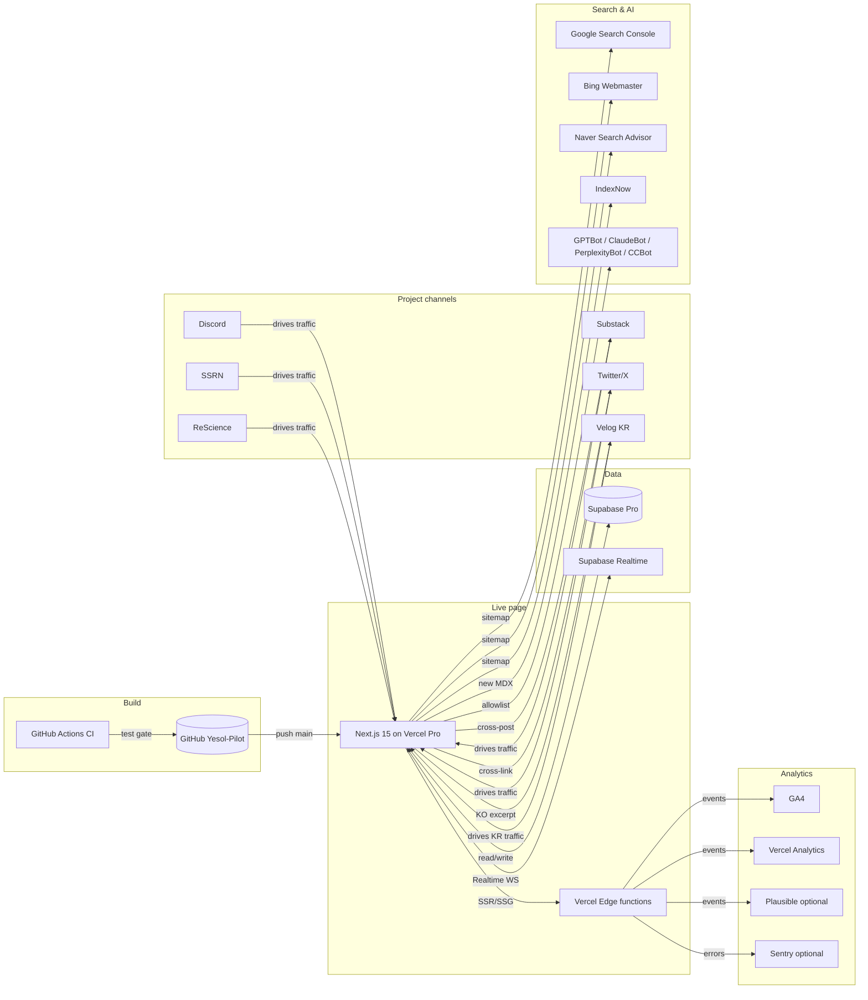

# 04 — Live Page Product Specification: `heoyesol.kr/quant`

> **Project**: `quant-poc-multi-asset` Live Production Surface (D4)
> **Maintainer**: Yesol Huh (Yesol-Pilot)
> **Author**: Strategy Lead Claude Opus 4.7 (autonomous, Neo Genesis runtime)
> **Date**: 2026-05-14 KST
> **Status**: Design v2.0 (canonical project landing spec for 12-week build)
> **Document role**: This is the canonical PRD for the project landing site itself. The site is the front-of-house surface for the quant project — not an owner portfolio, not a career page.
>
> **Sister docs**:
> - `docs/design/01-architecture-spec.md` — system architecture, schemas, multi-agent runtime
> - `docs/design/02-alpha-specs-21.md` — 21 alpha catalog (KR / US / Options / Crypto archive)
> - `docs/design/03-12week-daily-plan-and-milestones.md` — 84-day daily build matrix + 5D excellence
> - `docs/research/10-live-page-tech-stack.md` — domain/stack/SEO research (Tier B #10)
> - `docs/research/00-research-final-summary.md` — 16-area cold honest summary
>
> **Predecessor evidence**: 38-day PoC (`v6~v11` ensemble), 191 trades / WR 37.7% / PnL −15.1% / 0/108 A2 sweep cells passing. Preserved as honest failure documentation, not hidden.

---

## v2.0 (2026-05-14) — owner cold honest 정정

owner quote: "여기서 내 이력을 팔고 홍보할 필요는 없어"

본 사이트 `heoyesol.kr/quant` 는 **순수 quant project landing page** 다.
- ❌ portfolio sale page 아님
- ❌ owner 이력서 / 채용 / 면접 / PM career sale 흔적 모두 제거
- ✅ Open Source + Academic + Community project 만

heoyesol.kr 메인 사이트 (별도) = owner 이력서 / portfolio / 채용 담당.
heoyesol.kr/quant = pure project (본 spec target).

### v2.0 변경 요약

- Persona A (Recruiter Han) REMOVE
- NSM 재정의 (portfolio reviewers → project engagement)
- Owner career framing 모두 REMOVE
- "PM craft proof" / "PM career visibility" 언급 모두 REMOVE
- Korean Retail Learner Park persona ADD (한국어 학습자 audience)
- /about 페이지 minimal author note + 메인 사이트 redirect 으로 단순화
- 12-week traffic / engagement target 재정의 (3 persona project-only)
- Risk register 재구성 (R: Korean SEO / project credibility / Korean learner audience 미달)
- heoyesol.kr 메인 ↔ /quant 분리 의도 명확화

### v1.0 vs v2.0 audit note

| 항목 | v1.0 | v2.0 |
|---|---|---|
| Personas | Recruiter Han / Indie Hacker Marc / Researcher Sarah | Indie Hacker Marc / Researcher Sarah / Korean Retail Learner Park |
| NSM | Weekly qualified portfolio reviewers | Weekly active project engagement |
| W12 NSM target | 300~600 portfolio reviewers | 5,000~30,000 monthly active project users |
| /about scope | owner profile + Toss rejection + 채용 CTA | minimal author note + redirect to heoyesol.kr |
| Section 11 funnel | 3 personas with career conversion path | 3 personas with project-only conversion (star / fork / citation / subscribe) |
| Section 14 risk | R: 채용 lever, portfolio review misread | R: Korean SEO quality, project credibility, Korean learner audience |
| 외부 reference | recruiter-outreach.md cross-link | removed |
| Honest failure tone | calibration over performance (recruiter signal) | rigor demands it (engineering signal) |

---

## Table of Contents

1. [Product Vision + Purpose](#1-product-vision--purpose)
2. [Target Audience (3 personas)](#2-target-audience-3-personas)
3. [Information Architecture](#3-information-architecture-sitemap)
4. [Detailed Page Spec (4 core pages)](#4-detailed-page-spec-4-core-pages)
5. [Design System](#5-design-system)
6. [UX Patterns](#6-ux-patterns)
7. [SEO + GEO Strategy](#7-seo--geo-strategy)
8. [Performance + Accessibility](#8-performance--accessibility)
9. [Operating Workflow](#9-operating-workflow)
10. [Content Strategy](#10-content-strategy)
11. [Funnel + Conversion](#11-funnel--conversion)
12. [12-Week Phased Rollout](#12-12-week-phased-rollout)
13. [Operating Model](#13-operating-model)
14. [Risk + Mitigation](#14-risk--mitigation)
15. [External Tools + Integrations](#15-external-tools--integrations)

---

## 1. Product Vision + Purpose

### 1.1 Mission Statement

**한국어**
`heoyesol.kr/quant` 는 글로벌 + 한국 quant 학습자 / 개발자 / 학자를 위한 honest, open source, academic-rigorous multi-asset quant project 다. 38일 PoC 의 -15.1% 실패 학습을 출발점으로 12주 build 의 모든 코드 / 결과 / 학술 paper / 실패까지 공개한다. 수익을 약속하지 않는다. 알파를 주장하지 않는다. multi-agent orchestration 과 9-Layer Kill Switch production wiring 을 공개 검증 가능하게 노출한다.

**English**
`heoyesol.kr/quant` is an honest, open source, academically rigorous multi-asset quant project for global and Korean quant learners, developers, and researchers. The 38-day PoC honest failure (-15.1% PnL, 0/108 cells passing the A2 sensitivity sweep) is the starting point. Over 12 weeks of build, every line of code, every result, every academic paper, and every failure is published openly. No alpha is claimed. Multi-agent orchestration, 9-Layer Kill Switch wiring, and DSR/PBO statistical rigor are exposed for public audit.

### 1.2 Why this project exists (project lens)

The conventional retail quant repo shows a cherry-picked equity curve. This project instead shows:

- **An end-to-end open spec** (this PRD) for a non-trivial multi-asset system
- **A 12-week execution plan** with Mon–Sun daily granularity (sister doc 03)
- **A working production site** that ships weekly under that plan
- **Honest failure documentation** — the rarest signal in any open source quant project
- **A multi-agent autonomous build model** — Strategy Lead Claude Opus 4.7 + Codex + Gemini run 95% of the work, with the human maintainer at 5% review. The site documents how that operating model works in practice, as a reusable pattern for other 1-maintainer projects.

The site is the proof. The artifact ships in public.

### 1.3 Differentiation Angle (5 axes simultaneously)

Cross-check from `docs/research/07-competitive-analysis.md`: global retail 1-person OSS quant top 1~3% holds 1~2 axes; this project holds **5+ axes simultaneously**, placing it at the top 0.01~0.05% of public retail quant work.

| Axis | What it means | Public proof on this site |
|---|---|---|
| **Honest Failure forensic** | 38-day PoC failure is the headline, not buried | Hero (`/`), 4 of the first 12 blog posts |
| **Open Source** | MIT, GitHub `Yesol-Pilot/quant-poc-multi-asset` | Footer link, every alpha page, README mirror |
| **Academic Rigor** | NeurIPS 2026 #20237 (MARL) + TMLR 2026 #8752 (causal safety) + SSRN + ReScience | `/papers` route, citation widgets, BibTeX |
| **Multi-Asset** | KR equities + US ETF + US options + crypto (archive) | `/dashboard` 4 tabs, `/alphas` filter |
| **Multi-Agent Operating Model** | Claude + Codex + Gemini autonomous build, maintainer 5% | Operating model diagram in `/research`, `/blog` build logs |

No single axis is novel. The combination is. The site must reinforce the combination on every page.

### 1.4 North Star Metric (NSM)

**NSM**: **Weekly active project engagement**, defined as the sum of:

1. GitHub stars added per week
2. Academic citations / SSRN downloads per week
3. Discord active members per week
4. Newsletter subscribers added per week
5. External PR merges per week

The NSM is intentionally non-vanity. Raw monthly visitors can spike from a single Hacker News post (+10,000/day for 24h then collapse). The NSM measures whether a visitor crossed the threshold of "this person could plausibly fork it, cite it, contribute to it, or follow it long-term."

Weekly NSM targets (Week N of build):

| Week | NSM target | Source dominance |
|---|---|---|
| W2 | 50 | GitHub README referral, project-shared LinkedIn, Twitter |
| W4 | 200 | + Newsletter #1, Korean blog cross-post |
| W6 | 600 | + Twitter compounding, first external PR |
| W8 | 1,500 | + Substack #2, Korean quant community engagement |
| W10 | 4,000 | + SEO long-tail starts firing, Naver KR pickup |
| W12 | 5,000~30,000 | + HN Tuesday 09:00 PT spike + monthly active project users |

W12 target represents monthly active project users (newsletter + Discord + GitHub watchers + recurring site visitors), not single-session traffic.

### 1.5 Secondary KPIs (decision-grade, not vanity)

| KPI | W12 target | Why it matters |
|---|---|---|
| GitHub stars | 300~600 (50% confidence) | OSS social proof for the project |
| Newsletter subscribers | 100~800 | Long-term communication channel |
| External contributors with merged PR | ≥ 3 | Strongest contributor signal |
| Korean newsletter subscribers (subset) | ≥ 50 | Korean retail learner reach |
| Discord active members (monthly) | ≥ 50 | Community engagement |
| Lighthouse Performance (mobile) | ≥ 90 (Pro target 95+) | Quality signal, SEO ranking |
| Lighthouse Accessibility | ≥ 95 (WCAG 2.1 AA) | Inclusive design |
| SSRN paper downloads | ≥ 50 | Academic seed; Quantpedia Awards eligibility |
| Substack open rate | ≥ 40% | Audience quality vs raw subscriber count |
| `/papers` page visits / total visits | ≥ 8% | Academic-track conversion signal |
| `/dashboard` median session time | ≥ 60s | Live-data engagement proof |

### 1.6 Anti-KPIs (deliberately deprioritized)

- Total page views (vanity; one HN spike distorts it)
- Twitter follower count (cheap; bot inflation common)
- Time on page across all pages (drowns by static pages)
- AdSense / sponsorship revenue in the 12-week window (premature monetization risk)

### 1.7 Success Criteria (12 weeks post-W12)

The 12-week build is successful if any **3 of 6** materialize:

1. NSM ≥ 5,000 monthly active project users by W16
2. ≥ 3 external contributors with merged PRs in the public repo
3. SSRN paper downloads ≥ 50 within 30 days of publish
4. ≥ 1 invited talk request (PyCon Korea, K-Quant Forum, university seminar, OSS conference)
5. ≥ 1 ReScience-style citation in a peer-reviewed venue or replication study
6. ≥ 1 inbound research collaboration request from a recognized hedge-fund / quant-shop researcher (D. Shaw, Two Sigma, AQR, Renaissance, or Korean equivalent — Mirae, NH-Amundi quant desk)

Failure criteria are explicit too: if NSM stalls below 500 by W6, the launch plan is overhauled (Section 14 risk matrix).

---

## 2. Target Audience (3 personas)

The site serves three project audiences. All three are end-users of the project itself (forkers, citers, subscribers, contributors, learners). The site does not target hiring funnels, recruiters, or interview pipelines — those flow through the separate `heoyesol.kr` main site.

### 2.1 Persona A — Indie Hacker Marc (global 1-person quant builder)

```
Name:        Marc Dubois
Title:       Solo founder / quant tinkerer
Age:         28
Location:    Lisbon (formerly SF)
Languages:   English native, French native, no Korean
Time budget: 15~45 minutes for a deep project read
Devices:     Linux desktop (HackerNews tab), iPad (reading mode)
Tools:       GitHub, Twitter/X, Discord, Substack, ChatGPT, Cursor
Motivation:  Looking for reusable patterns. Specifically: 9-Layer Kill Switch
             wiring, multi-agent orchestration, Supabase Realtime for trading
             dashboards. Will fork, star, possibly contribute back.
Pain point:  Cherry-picked OSS quant repos that hide the failure. Marc has
             been burned 3 times by repos that show only the winning chart.
             He values "show me the loss curve" repos disproportionately.
```

**Sessions per project**: 1 long (HN front-page entry) + 2~5 returns over a month if hooked.

**First-30-seconds engagement design**

Marc enters via Hacker News. He has already read the title in HN ("Show HN: I shipped a quant bot, lost 15%, here is everything"). The hero must:

1. Confirm the headline is not bait — show the -15.1% chart immediately
2. Surface the GitHub link in the first viewport
3. Show the "Why this didn't work" framing on hover or scroll

The hero already does this. The differentiator for Marc is the **second viewport scroll**: Architecture diagram (Mermaid in `01-architecture-spec.md`) embedded as a static SVG. Marc reads architecture diagrams before bios.

**Most important pages for Marc**

| Rank | Page | Why |
|---|---|---|
| 1 | README (on GitHub) | This is his "homepage" — Marc clicks GitHub first |
| 2 | `/research/01` (architecture) and `/design/01-architecture-spec` | Reusable patterns |
| 3 | `/alphas` and `/alphas/[id]` | Forkable specifications |
| 4 | `/blog` | Build-in-public posts; subscribes to RSS |

**User journey**

```
HN front page → /quant (15s scan) → GitHub README (5 min) → /design/01 (8 min)
  → /alphas (3 min) → /alphas/A2_OU_failure (5 min, reads sweep heatmap)
  → /blog/why-i-killed-my-38-day-quant-bot (4 min)
  → GitHub star → Discord join → RSS subscribe

Returns at Day +7, +14, +30 when new posts ship.
```

**Conversion**: GitHub star + Discord join. Possible: opens issue requesting Bybit support or comments on a sensitivity sweep. Highest signal: external PR merged.

### 2.2 Persona B — Quant Researcher Sarah (academic / industry quant)

```
Name:        Dr. Sarah Mitchell
Title:       Quantitative Researcher at AQR Capital (or postdoc, finance dept)
Age:         34
Location:    NYC / Boston
Languages:   English native
Time budget: 20~60 minutes if the abstract passes filter
Devices:     MacBook Pro (SSRN search), iPad (commute paper reading)
Tools:       SSRN, arXiv, Quantpedia, Google Scholar, Mendeley/Zotero
Motivation:  Looking for replication candidates, novel failure documentation
             (negative-results lit is underdeveloped), or KR-market evidence
             for FF5 / momentum / PEAD that she can cite. May email maintainer
             for project-related collaboration.
Pain point:  Replication crisis in quant lit. 90%+ of factor-zoo papers
             don't survive out-of-sample. A 1-maintainer retail replication
             of Fama-French 5-factor on KOSPI 200 with full sensitivity
             sweep is rare and citeable.
```

**Sessions per project**: 1 (deep first read) + 1 (citation lookup on writing day).

**First-30-seconds engagement design**

Sarah enters via SSRN search or Quantpedia link. She lands on `/papers/[slug]` directly, never sees `/`. The paper landing page must:

1. Display the SSRN abstract verbatim above the fold
2. Show the methodology stack (DSR / PBO / 108-cell sweep) in a 4-row table
3. Provide BibTeX one-click copy
4. Link to the GitHub repo with the exact commit hash referenced in the paper

**Most important pages for Sarah**

| Rank | Page | Why |
|---|---|---|
| 1 | `/papers/[slug]` | Direct entry; primary purpose |
| 2 | `/research` (catalog) | Other related work check |
| 3 | `/alphas` filtered by `academic_refs > 0` | Source code for replication |
| 4 | `/about` (minimal author note) | Maintainer + project attribution |

**User journey**

```
SSRN/Quantpedia → /papers/2026-ff5-kospi (4 min abstract + methods)
  → BibTeX copy → GitHub commit hash open
  → /alphas/A11_ff5_kr_equity (12 min, methodology + tests + sweep)
  → /research/06-academic-references (3 min, related citations)
  → email project address for collaboration

Possible return: Cites the paper in her own working paper 3~6 months later.
```

**Conversion**: SSRN paper download + email + (eventual) citation.

### 2.3 Persona C — Korean Retail Learner Park (한국 quant 학습자)

```
Name:        박지호 (Park Ji-ho)
Title:       30대 직장인 또는 대학원생 (in current job: software developer,
             data analyst, or finance domain entry-level)
Age:         28~38
Location:    Seoul / Pangyo / Songdo / 광역시 거주
Languages:   Korean native, English read-only (technical comfortable)
Time budget: 30~90 minutes per session, returns weekly if hooked
Devices:     Mobile (Naver search, Velog reading) + Desktop (GitHub read,
             Jupyter notebook follow-along)
Tools:       Naver, Velog, Brunch, 카페 (조용한 모임), Discord (한국 channel),
             Coursera / 인프런 / 패스트캠퍼스
Motivation:  AI / 알고리즘 트레이딩 / 핀테크 / quant finance 학습. 한국어
             educational 자료 부족 (대부분 영어 + 미국 시장 기반). honest
             한국 retail 사례 + 한국어 + open source 가 매우 희귀.
Pain point:  유튜브 / 블로그 정보는 cherry-picked + 광고 + 강의 판매. 한국어
             로 된 정직한 quant 실패 케이스 + 학술적 backbone 을 동시에
             가진 source 가 거의 없음. 영어 OSS repos 는 한국 시장 (KIS API
             / 한국 시간대 / KOSPI / KOSDAQ) 을 다루지 않음.
```

**Sessions per project**: 3~10 over 3 months if hooked. Korean retail learners are repeat-visit dominant.

**First-30-seconds engagement design**

Park enters via Naver search ("AI 자동매매 후기", "한국 퀀트 봇 오픈소스", "퀀트 백테스트 후기") or Korean Discord / 카페 / Velog recommendation. He lands on `/ko/` (Korean homepage) or `/ko/blog/[slug]`.

The Korean homepage must:

1. Confirm the project is genuinely Korean (KIS API, KOSPI, KOSDAQ tabs visible)
2. Show that content is genuinely Korean (not machine-translated; 자연스러운 한국어)
3. Surface the educational angle — 38일 PoC 실패 학습 → 12주 honest build → 학술적 backbone
4. Make the GitHub + Newsletter + Discord 한국 channel CTAs prominent

**Most important pages for Park**

| Rank | Page | Why |
|---|---|---|
| 1 | `/ko/blog/[slug]` | Korean-language educational content |
| 2 | `/ko/research` | 한국어 자료 catalog |
| 3 | `/ko/alphas/[id]` | Forkable alpha specs with Korean docs |
| 4 | `/ko/papers/[slug]` | 학술 backbone (Korean abstract + BibTeX) |

**User journey**

```
Naver / 카페 / Velog → /ko/blog/why-i-killed-my-38-day-quant-bot (5 min)
  → /ko/ (1 min) → /ko/research (3 min) → /ko/alphas (2 min)
  → /ko/alphas/A11 (8 min, Korean docs)
  → Newsletter (한국어 subscribe) → Discord 한국 channel join
  → GitHub star (low friction)

Returns:
  - Day +7: 새 블로그 포스트 (Naver / Velog cross-post)
  - Day +30: 한국어 newsletter 발송
  - Day +60: KOSPI 백테스트 결과 업데이트
  - Day +90+: 자체 fork 또는 댓글로 질문
```

**Conversion**: Korean newsletter subscribe + Discord 한국 channel + GitHub star. Highest signal: Korean learner contributes Korean translation PR or asks a substantive question in Discord.

### 2.4 Persona reach calibration

| Persona | Site share (W12 NSM mix) | Acquisition channel | Highest-leverage page for them |
|---|---|---|---|
| A — Indie Hacker Marc | 45~55% | Hacker News, Twitter, Discord, GitHub Explore | README + `/design/01` |
| B — Researcher Sarah | 15~25% | SSRN, Quantpedia, Google Scholar | `/papers/[slug]` |
| C — Korean Retail Learner Park | 25~35% | Naver, Korean Discord, Velog, 카페 | `/ko/blog/[slug]` + `/ko/research` |

We deliberately design for all three on each page (no persona-mode toggle). The hero serves Marc and Park equally; the `/papers` route serves Sarah without harming the other two. Korean translation parity (Section 6.2) is the load-bearing UX investment for Park.

---

## 3. Information Architecture (sitemap)

### 3.1 Sitemap (Mermaid)

```mermaid
graph TD
  ROOT["/<br/>(Homepage)"]
  ABOUT["/about<br/>minimal author note"]
  DASH["/dashboard<br/>Live paper trading"]
  ALPHAS["/alphas<br/>21+ catalog"]
  ALPHA_ID["/alphas/:id<br/>detail per alpha"]
  RESEARCH["/research<br/>16 docs catalog"]
  RES_SLUG["/research/:slug<br/>MDX render"]
  DESIGN["/design<br/>4+ specs catalog"]
  DES_SLUG["/design/:slug<br/>MDX render"]
  PAPERS["/papers<br/>SSRN + ReScience + arXiv status"]
  PAPER_SLUG["/papers/:slug<br/>abstract + BibTeX"]
  BLOG["/blog<br/>12+ posts"]
  BLOG_SLUG["/blog/:slug<br/>MDX post"]
  API["/api<br/>public API + playground"]
  COMMUNITY["/community<br/>Discord + GH Disc + Newsletter"]
  CONTACT["/contact<br/>project email"]
  NEWSLETTER["/newsletter<br/>Substack iframe"]
  DISCLAIMER["/disclaimer<br/>no advice, no alpha"]

  ROOT --> ABOUT
  ROOT --> DASH
  ROOT --> ALPHAS
  ROOT --> PAPERS
  ROOT --> BLOG
  ROOT --> COMMUNITY
  ALPHAS --> ALPHA_ID
  RESEARCH --> RES_SLUG
  DESIGN --> DES_SLUG
  PAPERS --> PAPER_SLUG
  BLOG --> BLOG_SLUG
  COMMUNITY --> NEWSLETTER
  ROOT --> CONTACT
  ROOT -.-> DISCLAIMER
  ROOT -.-> API

  classDef primary fill:#1f3a5f,stroke:#0a2540,color:#fff
  classDef secondary fill:#3a4f6b,stroke:#1f3a5f,color:#fff
  classDef utility fill:#666,stroke:#444,color:#fff,stroke-dasharray:3 3
  class ROOT,ABOUT,DASH,ALPHAS,PAPERS primary
  class ALPHA_ID,RESEARCH,DESIGN,RES_SLUG,DES_SLUG,PAPER_SLUG,BLOG,BLOG_SLUG primary
  class COMMUNITY,NEWSLETTER,CONTACT secondary
  class API,DISCLAIMER utility
```



### 3.2 Route table (URL spec + content type + caching)

| Route | Content type | Rendering | Cache | Locale | Owner |
|---|---|---|---|---|---|
| `/` | TSX | SSG + ISR 1h | Edge | both | Strategy Lead |
| `/about` | MDX (minimal author note) | SSG | Edge 24h | both | Strategy Lead |
| `/dashboard` | TSX + Supabase Realtime | SSR + client subscribe | no | both | Strategy Lead |
| `/alphas` | TSX | SSG + ISR 1h | Edge | both | Strategy Lead |
| `/alphas/[id]` | MDX + dynamic data | SSG (generateStaticParams) + ISR | Edge | both | Strategy Lead |
| `/research` | TSX (auto-indexed from `/content/research/*.mdx`) | SSG | Edge 24h | both | Strategy Lead |
| `/research/[slug]` | MDX | SSG | Edge 24h | both | Strategy Lead |
| `/design` | TSX | SSG | Edge 24h | both | Strategy Lead |
| `/design/[slug]` | MDX | SSG | Edge 24h | both | Strategy Lead |
| `/papers` | TSX | SSG | Edge 24h | both | Strategy Lead |
| `/papers/[slug]` | MDX + BibTeX | SSG | Edge 24h | both | Strategy Lead |
| `/blog` | TSX (RSS auto-generated) | SSG + ISR 1h | Edge | both | Strategy Lead |
| `/blog/[slug]` | MDX | SSG | Edge 24h | both | Strategy Lead |
| `/contact` | TSX (project email) | SSG | Edge 24h | both | Strategy Lead |
| `/community` | TSX | SSG | Edge 24h | both | Strategy Lead |
| `/newsletter` | TSX + Substack iframe | SSG | Edge 24h | both | Strategy Lead |
| `/disclaimer` | MDX | SSG | Edge 24h | both | Maintainer final review, legal |
| `/api/og` | Edge function | dynamic | Edge | n/a | Strategy Lead |
| `/api/health` | Edge function | dynamic | no | n/a | Strategy Lead |
| `/api/v1/trades` | API route (rate-limited) | SSR | no | n/a | Strategy Lead |
| `/api/v1/alphas` | API route (rate-limited) | SSR | Edge 1h | n/a | Strategy Lead |

### 3.3 Utility routes (not in main nav)

- `/manifest.json` — PWA manifest (icon, theme color, display: standalone)
- `/sitemap.xml` — sitemap index → `/sitemap-en.xml`, `/sitemap-ko.xml`
- `/sitemap-en.xml`, `/sitemap-ko.xml` — language-specific sitemaps with hreflang
- `/robots.txt` — explicit AI crawler allowlist (Section 7.4)
- `/llms.txt` — Anthropic-standard AI-discoverable index (Section 7.5)
- `/llms-full.txt` — full content concatenation for LLM ingestion
- `/feed.xml` — RSS for `/blog`
- `/atom.xml` — Atom alternative for older readers

### 3.4 Locale routing

`next-intl` with App Router. Default locale: English (global audience prioritized for OSS reach). Korean explicit at `/ko/*` (load-bearing for Persona C).

```
heoyesol.kr/quant            → English (default)
heoyesol.kr/quant/ko         → Korean homepage (Persona C primary entry)
heoyesol.kr/quant/ko/about   → Korean about
heoyesol.kr/quant/papers/ff5 → English paper
heoyesol.kr/quant/ko/papers/ff5 → Korean paper translation
```

`<html lang="en">` and `hreflang` alternates emitted on every page. Locale switch preserves the current path (Section 6.2).

### 3.5 Navigation IA

**Primary nav (desktop + mobile)**:
- Dashboard
- Alphas
- Papers
- Research
- Blog
- About

**Secondary (footer)**:
- Design specs
- API
- Newsletter
- Community
- Contact (project email)
- Disclaimer
- GitHub, Discord, Substack, SSRN profile (project channels only)

**Top utility (right-aligned)**:
- Language toggle (EN | KO)
- Theme toggle (light / dark / system)
- GitHub star count badge

Mobile primary nav collapses into a hamburger drawer. Bottom-of-screen sticky CTA on mobile: "Star on GitHub" (Marc) or "Subscribe to newsletter" (Park). A/B test which converts better (Section 9.4).

---

## 4. Detailed Page Spec (4 core pages)

### 4.1 Homepage `/`

**Goal**: 30-second qualification for 3 personas + funnel into the right next page.

**Section breakdown (vertical scroll)**

```
┌────────────────────────────────────────────────────────────────┐
│ [1] Hero — Honest Failure framing                              │
│     - "-15.1% PnL. 38 days. 191 trades." in 64px serif         │
│     - subtitle one sentence                                    │
│     - 3 CTAs: [Dashboard] [PRD] [GitHub]                       │
│     - small "LIVE" pulse badge with last-updated timestamp     │
├────────────────────────────────────────────────────────────────┤
│ [2] 5D Excellence Progress Cards (D1~D5)                       │
│     - 5 cards in 5-col grid (desktop) / 1-col (mobile)         │
│     - each card: dim icon, title, current week metric          │
│     - color-coded ring (red <50% / yellow 50-80% / green 80%+) │
├────────────────────────────────────────────────────────────────┤
│ [3] Live Metric Widget (small, embedded)                       │
│     - Sharpe / DSR / WR / 4-asset PnL sparkline               │
│     - last updated <Ns ago>                                    │
│     - "Open full dashboard →"                                  │
├────────────────────────────────────────────────────────────────┤
│ [4] Recent Updates Feed (3-column)                             │
│     col1: Blog (latest 3 posts)                                │
│     col2: GitHub (latest 3 commits, via API)                   │
│     col3: Papers (latest 3 status changes)                     │
├────────────────────────────────────────────────────────────────┤
│ [5] Why this project exists (1-paragraph project lens)         │
│     - links to /about for the minimal author note              │
├────────────────────────────────────────────────────────────────┤
│ [6] Multi-Asset summary (4-card)                               │
│     KR equities / US ETF / US options / Crypto archive        │
│     each card: alpha count, status, "See alphas →"             │
├────────────────────────────────────────────────────────────────┤
│ [7] Academic backbone (1-row)                                  │
│     - NeurIPS 2026 #20237 badge                                │
│     - TMLR 2026 #8752 badge                                    │
│     - SSRN paper status badge                                  │
│     - "See papers →"                                           │
├────────────────────────────────────────────────────────────────┤
│ [8] CTAs row                                                   │
│     - Star on GitHub                                           │
│     - Subscribe newsletter                                     │
│     - Join Discord                                             │
├────────────────────────────────────────────────────────────────┤
│ [9] Footer (sitemap + project social + sticky disclaimer link) │
└────────────────────────────────────────────────────────────────┘
```

**Honest Failure framing — design decisions**

The number `-15.1%` is the largest text element on the page. Color: `--color-loss` (a muted red, not alarm-red — see Section 5.1). Subtitle below: "I shipped the failure documentation, not the alpha."

This is contrarian. Standard quant repo design hides losses. We promote them. The rationale: a forker, citer, or researcher who sees `-15.1%` first will trust everything else on the site more. Rigor demands the failure be visible, not hidden.

**5D progress cards content (W1 → W12)**

Each card has:
- Title (D1 Code Quality, D2 Academic Rigor, ...)
- Current week metric (e.g., "742 tests / 78% coverage")
- W12 target (e.g., "1,000+ / 90%")
- Ring fill: current / target ratio
- Tooltip on hover: link to source-of-truth doc

**Live Metric Widget**

```
┌─────────────────────────────────┐
│ Sharpe   DSR   WR    4-asset    │
│ 0.42    0.31  41.2%  [spark]    │
│              LIVE • 23s ago     │
└─────────────────────────────────┘
```

The widget subscribes to `daily_metrics` table via Supabase Realtime. If subscription fails (rare), it falls back to a cached SSG value from build time with a "Cached, last updated 4h ago" badge.

**Mobile layout** (≤768px)

Sections 1, 3 (compressed widget), 6 (4-card → 2×2 grid), 8 (sticky bottom). Sections 2 (5-col → vertical stack), 4 (3-col → single col), 5, 7, 9 (standard).

Desktop nav is replaced by hamburger. Sticky bottom CTA: "Star on GitHub ⭐ 247" (live count).

### 4.2 Dashboard `/dashboard`

**Goal**: Prove "this actually runs" + give researcher Sarah methodology depth + give Korean learner Park 한국 시장 데이터 가시성.

**Layout (desktop)**

```
┌─────────────────────────────────────────────────────────────────┐
│ Live Paper Trading Dashboard                                    │
│ 12-week 4-asset POC • [LIVE pulse] • last update 12s ago        │
├─────────────────────────────────────────────────────────────────┤
│ Asset tabs: [ KR Equities ] [ US ETF ] [ Options ] [ Crypto* ]  │
│                                            * archived 38d PoC   │
├─────────────────────────────────────────────────────────────────┤
│ ┌─────────┬─────────┬─────────┬─────────┐                       │
│ │ Sharpe  │  DSR    │ MaxDD   │ WR      │  ← KPI strip          │
│ │ 0.42    │ 0.31    │ -3.2%   │ 41.2%   │     for selected tab  │
│ └─────────┴─────────┴─────────┴─────────┘                       │
├─────────────────────────────────────────────────────────────────┤
│ Equity curve (line chart, last 30d)                             │
│  ─ this strategy   ─ KOSPI benchmark   ─ S&P 500 benchmark      │
├─────────────────────────────────────────────────────────────────┤
│ Alpha breakdown table (sortable, filterable)                    │
│  Alpha | Status | Trades | WR | PnL | Sharpe | DSR | [link]    │
│  A11    Active   42       0.43 +1.2%  0.51    0.34   →         │
│  A12    Active   28       0.39 -0.8%  0.21    0.18   →         │
│  ...                                                            │
├─────────────────────────────────────────────────────────────────┤
│ Regime indicator (current)                                      │
│  KR: HORIZONTAL  |  US: BULL  |  Crypto: ARCHIVED               │
├─────────────────────────────────────────────────────────────────┤
│ Kill Switch Status (12-Layer visualization)                     │
│  L1 ✓ L2 ✓ L3 ✓ L4 ✓ L5 ✓ L6 ✓ L7 ✓ L8 ✓ L9 ✓ L10 ✓ L11 ✓ L12 ✓│
│  (all green; click any layer for description + last-tested ts)  │
├─────────────────────────────────────────────────────────────────┤
│ Recent trades feed (last 20, scroll, auto-update)               │
│  21:34:12 KST  A11 LONG  005930 KOSPI  Samsung  +0.43%          │
│  21:32:08 KST  A14 SHORT 035420 KOSDAQ Naver    -0.12%          │
│  ...                                                            │
├─────────────────────────────────────────────────────────────────┤
│ Disclaimer banner: "Paper trading only. No financial advice."   │
└─────────────────────────────────────────────────────────────────┘
```

**Asset tabs**

- **KR Equities** (KIS API paper trading) — A11~A14, status Active or Standby
- **US ETF** (IBKR paper) — A15~A17, status Active or Standby
- **US Options** (IBKR paper) — A19~A21, status Backtest-only or Active
- **Crypto*** — archived 38-day PoC; tab loads the historical archive view with a "ARCHIVED" banner

Default tab on first load: KR Equities (highest volume of data after W4, and primary Park interest).

**Equity curve chart**

Tremor `<LineChart>` with three series:

- This strategy (asset-specific, primary color)
- Benchmark (KOSPI / S&P 500 depending on tab)
- Optional: rolling 30-day Sharpe (toggleable)

Time range selector: 7d / 30d / 90d / all. Last-N hover crosshair.

**KPI strip**

Sharpe / DSR / MaxDD / WR computed from `daily_metrics` aggregated to the asset class. Each KPI has a tooltip with the formula. Color rules:

- Sharpe: red <0, yellow 0~1.0, green >1.0
- DSR: red <0.2, yellow 0.2~0.5, green >0.5 (Bailey 2014 standard)
- MaxDD: red < -10%, yellow -10%~-5%, green > -5%
- WR: not color-coded (WR alone is misleading; flagged in tooltip)

**Alpha breakdown table**

Sortable columns. Each row clickable → `/alphas/[id]`. Filterable by status (Active / Standby / Archived / Deprecated).

**Regime indicator**

Computed from `regime_calculator` job (runs every 5 min on Vercel cron). States: BULL / BEAR / HORIZONTAL / VOLATILE. Each tab shows its own.

**Kill Switch visualization**

12 small badges. Green = layer passed its self-test in the last hour. Yellow = stale (>1h). Red = layer triggered (would show the last trigger timestamp).

Click any layer to open a modal:
- Layer description (e.g., "L4: Daily loss > 2% halts new entries")
- Last self-test timestamp
- Last actual trigger (or "never" — preferred)
- Source code link (GitHub permalink)

**Recent trades feed**

WebSocket subscription on `paper_trades` INSERT events. Newest first. Max 20 rows; older rows fade out. Animation: new row slides in from top with a 200ms pulse on the timestamp.

**Mobile layout**

Tabs become a swipeable carousel. KPI strip becomes 2×2 grid. Equity curve full-width with smaller axis labels. Alpha table becomes a vertical card list (Alpha name + 4 KPIs). Kill switch becomes a single condensed bar with a "12 layers ✓" pill (tap to expand).

**Empty / loading states**

- First-load skeleton (Tailwind animate-pulse on each section)
- "No trades yet" empty state for tabs without W2+ data — show a placeholder with "Live trading begins in W2 (KR), W4 (US), W6 (options)"
- Subscription failure: yellow toast "Real-time feed reconnecting…" + retry in 3s
- Persistent failure (3 retries fail): grey banner "Cached view, last updated <timestamp>"

### 4.3 Alphas Catalog `/alphas`

**Goal**: Allow Marc, Sarah, and Park to filter 21 alphas to the 1~3 they want to drill into, in under 30 seconds.

**Layout**

```
┌─────────────────────────────────────────────────────────────────┐
│ Alphas Catalog                                                  │
│ 21 alphas • 4 asset classes • MIT licensed                      │
├─────────────────────────────────────────────────────────────────┤
│ Filters:                                                        │
│  Asset class: [ All | KR | US ETF | Options | Crypto ]          │
│  Status:      [ All | Active | Standby | Archived | Deprecated ]│
│  DSR ≥        [ -- | 0.2 | 0.5 ]                                │
│  WR ≥         [ -- | 40% | 50% ]                                │
│  Has academic ref: [ off | on ]                                 │
│ Sort:                                                           │
│  [ DSR ↓ | Sharpe ↓ | Newest | Trades ↓ ]                       │
├─────────────────────────────────────────────────────────────────┤
│ ┌───────────────┐ ┌───────────────┐ ┌───────────────┐           │
│ │ A11           │ │ A12           │ │ A13           │           │
│ │ FF5 KR equity │ │ Momentum KR   │ │ PEAD KR       │           │
│ │ Active        │ │ Active        │ │ Standby       │           │
│ │ DSR 0.34      │ │ DSR 0.18      │ │ DSR --        │           │
│ │ [mini chart]  │ │ [mini chart]  │ │ [mini chart]  │           │
│ │ 3 refs        │ │ 5 refs        │ │ 2 refs        │           │
│ └───────────────┘ └───────────────┘ └───────────────┘           │
│ ... (21 cards, 3-col grid, paginated 12/page)                   │
├─────────────────────────────────────────────────────────────────┤
│ Archived alphas (7) — collapsed by default                      │
│  A1 Liquidation Cascade (crypto, 38d PoC)                       │
│  A2 OU Mean Reversion (0/108 sweep cells passing)               │
│  ...                                                            │
└─────────────────────────────────────────────────────────────────┘
```

**Card design**

```
┌─────────────────────────────────┐
│ A11                  [Active]   │   ← badge color: green/yellow/grey
│ FF5 KR Equity                   │
│ Fama-French 5-factor on KOSPI   │
├─────────────────────────────────┤
│ DSR 0.34  Sharpe 0.51  WR 43%   │
│ 42 trades  •  PnL +1.2%          │
├─────────────────────────────────┤
│ [mini equity curve — sparkline] │
├─────────────────────────────────┤
│ Refs: 3 academic  •  4 tests    │
│ Last update: 2h ago             │
│ [Open detail →]                 │
└─────────────────────────────────┘
```

**Empty states**

- Filter combination yields zero results: "No alphas match. Try removing a filter, or browse all 21."
- Alpha archived: card has a grey overlay + "ARCHIVED" stamp; clicking still opens detail.

**Sort default**: DSR descending (best statistically validated first), with archived alphas at the bottom regardless of DSR.

### 4.4 Alpha Detail `/alphas/[id]`

**Goal**: Give Sarah, Marc, and Park a self-contained, citeable, forkable specification of a single alpha.

**Layout**

```
┌─────────────────────────────────────────────────────────────────┐
│ A11 • FF5 KR Equity                                  [Active]   │
│ Fama-French 5-factor replication on KOSPI 200                   │
│                                                                 │
│ Status: Active since W2 D8 (2026-05-26)                         │
│ Asset: KR equities (KIS API paper)                              │
│ Maintainer: Strategy Lead Claude Opus 4.7 (autonomous build)    │
├─────────────────────────────────────────────────────────────────┤
│ Origin                                                          │
│ ┌─────────────────────────────────────────────────────────┐     │
│ │ Fama & French (2015) "A Five-Factor Asset Pricing Model"│     │
│ │ JFE 116(1), 1–22. DOI: 10.1016/j.jfineco.2014.10.010    │     │
│ │ [Open paper] [BibTeX]                                   │     │
│ └─────────────────────────────────────────────────────────┘     │
├─────────────────────────────────────────────────────────────────┤
│ Hypothesis (cold honest)                                        │
│ "Five factors — market, size, value, profitability, investment │
│  — explain cross-sectional KR equity returns. KR-specific      │
│  caveat: only 4 of 62 cited papers test FF5 on KOSPI; results  │
│  are mixed (Kim & Park 2019: profitability significant, size   │
│  insignificant)."                                               │
├─────────────────────────────────────────────────────────────────┤
│ Backtest Results                                                │
│  Equity curve (in-sample 2018–2024, OOS 2025)                  │
│  [Tremor LineChart, 6-year span]                                │
│                                                                 │
│  Regime breakdown                                               │
│  ┌──────────┬──────┬───────┬───────┬───────┐                   │
│  │ Regime   │ Days │ Sharpe│ MaxDD │ Trades│                   │
│  │ BULL     │ 412  │ 0.72  │ -2.1% │ 18    │                   │
│  │ BEAR     │ 89   │ -0.41 │ -8.3% │ 9     │                   │
│  │ HORIZ    │ 234  │ 0.18  │ -3.2% │ 12    │                   │
│  │ VOLATILE │ 67   │ 0.91  │ -1.8% │ 5     │                   │
│  └──────────┴──────┴───────┴───────┴───────┘                   │
│                                                                 │
│  DSR / PBO                                                      │
│  DSR = 0.34 (Bailey 2014; >0.2 minimum, >0.5 strong)            │
│  PBO = 0.31 (Bailey & López de Prado 2014; <0.5 acceptable)    │
├─────────────────────────────────────────────────────────────────┤
│ Sensitivity Sweep (108-cell heatmap)                            │
│ Lookback × rebalance × signal-cutoff × stop-loss                │
│  [Heatmap — Tremor, color-coded by Sharpe]                      │
│  78 / 108 cells pass acceptance gate (Sharpe>0, DSR>0.2)        │
│  Compare: A2 OU sweep 0/108 (archived)                          │
├─────────────────────────────────────────────────────────────────┤
│ Test cases (14 unit + 4 integration)                            │
│  ┌───────────────────────────────────────────────────────┐     │
│  │ test_ff5_signal_returns_finite ✓                       │     │
│  │ test_ff5_rebalance_within_kis_rps ✓                   │     │
│  │ test_ff5_kill_switch_triggers_on_maxdd ✓              │     │
│  │ ... 15 more                                            │     │
│  └───────────────────────────────────────────────────────┘     │
│  Coverage: 92% (line) / 88% (branch)                            │
│  [View on GitHub →]                                             │
├─────────────────────────────────────────────────────────────────┤
│ Code snippet                                                    │
│  [Shiki-rendered, syntax highlighted, copy button]              │
│  src/alpha/a11_ff5_kr.py                                        │
│  [embed first 40 lines]                                         │
│  [Open full file on GitHub →]                                   │
├─────────────────────────────────────────────────────────────────┤
│ Related alphas                                                  │
│  A12 Momentum KR  •  A13 PEAD KR  •  A14 Quality KR             │
├─────────────────────────────────────────────────────────────────┤
│ Disclaimer banner: "Paper trading only. Not financial advice."  │
└─────────────────────────────────────────────────────────────────┘
```

**Special section for archived alphas (A1, A2)**

When `status == "archived"` or `"deprecated"`, prepend a callout:

> **Why this didn't work**
> A2 was deprecated in W0 (pre-build) after a 108-cell sensitivity sweep yielded 0 passing cells. The OU mean-reversion hypothesis on BTC-PERP had spec-level market fit failure, not parameter-tuning failure. Full sweep heatmap below.

This callout is the highest-value content on the site for Marc and Sarah. It is the differentiator from 99% of other quant repos.

---

## 5. Design System

### 5.1 Color Palette

Built on **Tailwind v4 + OKLCH** color tokens, dark-mode-first (default), light-mode opt-in. shadcn/ui base.

**Brand neutrals (slate-based, cold professional)**

```css
/* tokens.css (excerpt) */
:root {
  --background:    oklch(0.99 0.005 240);   /* near-white, faint blue tilt */
  --foreground:    oklch(0.18 0.02 240);
  --card:          oklch(0.98 0.005 240);
  --card-foreground: oklch(0.18 0.02 240);
  --muted:         oklch(0.93 0.01 240);
  --muted-foreground: oklch(0.45 0.02 240);
  --border:        oklch(0.88 0.01 240);
  --ring:          oklch(0.55 0.15 240);
}

.dark {
  --background:    oklch(0.13 0.015 240);   /* deep slate, not pure black */
  --foreground:    oklch(0.95 0.01 240);
  --card:          oklch(0.16 0.015 240);
  --muted:         oklch(0.22 0.015 240);
  --border:        oklch(0.28 0.015 240);
}
```

**Semantic colors (universal)**

```css
--color-success:  oklch(0.62 0.16 145);   /* green */
--color-warning:  oklch(0.74 0.16 75);    /* amber */
--color-danger:   oklch(0.58 0.20 25);    /* red */
--color-info:     oklch(0.60 0.18 240);   /* blue */

/* Honest-failure tone — muted so -15.1% is sober, not alarmist */
--color-loss:     oklch(0.55 0.14 25);    /* desaturated red */
--color-gain:     oklch(0.60 0.14 145);   /* desaturated green */
```

**Asset-specific accents** (sparingly used; only in tab indicators and small badges)

```css
--asset-kr-equity:  oklch(0.58 0.18 25);   /* taegeuk red */
--asset-us-etf:     oklch(0.52 0.18 250);  /* US blue */
--asset-options:    oklch(0.62 0.15 145);  /* greek green */
--asset-crypto:     oklch(0.65 0.18 60);   /* archived bitcoin orange */
```

Asset accents never set background of large surfaces. They appear only in:
- Asset tab underline (4px)
- Asset card top-border (2px)
- Inline badges

This keeps the visual language unified; asset diversity is signaled in detail, not in tone.

### 5.2 Typography

**Korean** — `Pretendard` (variable, OFL). Used for all Korean content.
**English / Latin** — `Inter` (variable, OFL). Used for English content + universal UI labels.
**Code / mono** — `JetBrains Mono` (variable, OFL). Used for code blocks, tickers (e.g., `005930`), and financial figures in tables.

Both via `next/font/google` + `next/font/local` with `display: swap` and `adjustFontFallback: true` (CLS protection — confirmed from 2026 Core Web Vitals guidance).

**Hierarchy**

| Token | Desktop | Mobile | Use |
|---|---|---|---|
| `display`  | 64px / 1.05 / -0.04em | 40px / 1.1  | Hero number |
| `h1`       | 40px / 1.15 / -0.02em | 28px / 1.2  | Page title |
| `h2`       | 28px / 1.25 / -0.01em | 22px / 1.3  | Section heading |
| `h3`       | 22px / 1.35           | 18px / 1.4  | Subsection |
| `h4`       | 18px / 1.4            | 16px / 1.4  | Card title |
| `body`     | 16px / 1.6            | 16px / 1.6  | Paragraph |
| `body-sm`  | 14px / 1.5            | 14px / 1.5  | Tooltip, caption |
| `mono`     | 14px / 1.5 (JetBrains) | 13px / 1.5 | Numbers, code |
| `caption`  | 12px / 1.4            | 12px / 1.4  | Timestamps, metadata |

Hero number uses Inter variable at weight 200 (thin) for the dramatic effect of "-15.1%" — a thin, large number reads as confident, not aggressive.

### 5.3 Spacing & Layout

8px grid. Tailwind defaults align. Container max-widths:

- `--container-prose`: 65ch (~720px) — for MDX content (`/research/[slug]`, `/blog/[slug]`, `/papers/[slug]`)
- `--container-dashboard`: 1440px — for `/dashboard`, `/alphas`
- `--container-narrow`: 960px — for `/about`, `/contact`

Breakpoints (Tailwind):

- `sm`: 640px (mobile landscape)
- `md`: 768px (tablet)
- `lg`: 1024px (small desktop)
- `xl`: 1280px (desktop)
- `2xl`: 1536px (large desktop)

Primary layout responsive ladder: mobile → 768px nav collapse → 1024px multi-column.

### 5.4 Component Inventory

**Base (shadcn/ui)** — vendored, not pulled at runtime:
Button, Card, Badge, Tabs, Tooltip, Dialog, Sheet, Dropdown, Toast, Input, Select, Table, Skeleton, Accordion, Separator, Avatar, Progress, Switch, ScrollArea.

**Chart (Tremor)** — for dashboards and inline data viz:
`<LineChart>`, `<AreaChart>`, `<BarChart>`, `<DonutChart>`, `<Tracker>`, `<DeltaBar>`, `<SparkLineChart>`, `<Card>`.

**Custom (built for this site)** — composing base + Tremor:

| Component | Purpose | Composition |
|---|---|---|
| `<AlphaCard>` | Catalog tile | Card + Badge + SparkLineChart + Tooltip |
| `<DashboardWidget>` | Live KPI tile | Card + Tremor metric + Realtime hook |
| `<KillSwitchIndicator>` | 12-layer status | Custom flex of 12 mini-badges + Dialog |
| `<EquityCurveChart>` | Equity vs benchmark | Tremor LineChart + multi-series + range selector |
| `<RegimeBadge>` | Current regime | Badge with semantic color + tooltip |
| `<SensitivitySweepHeatmap>` | 108-cell sweep | Custom Canvas (Tremor unsuited for 100+ cells) |
| `<AcademicCitation>` | Citation pill | Tooltip on hover + BibTeX copy |
| `<LocaleToggle>` | EN / KO switch | Dropdown + next-intl `usePathname` |
| `<ThemeToggle>` | light/dark/system | next-themes + Dropdown |
| `<LiveBadge>` | LIVE + last update | Pulse animation + relative time |
| `<CodeBlock>` | MDX code | Shiki SSR + copy button + GitHub permalink |
| `<DisclaimerBanner>` | Sticky disclaimer | Fixed bottom-right on /dashboard, /alphas/[id] |

Total component count: ~20 base + 8 Tremor + 12 custom = **40 components**. Manageable for a 1-maintainer + Strategy Lead build.

### 5.5 Iconography

`lucide-react` (active, tree-shakable, MIT). Used everywhere. No emoji.

Asset class icons:
- KR equity: 📊 substituted with `lucide-react` `BarChart3`
- US ETF: `LineChart`
- Options: `GitBranch`
- Crypto archive: `Archive`

For social, lucide variants where available; otherwise `simple-icons` for brand glyphs (GitHub, Discord, Substack).

### 5.6 Motion & Animation

Conservative. Real-time data already provides motion. Decorative animation creates dashboard cognitive load.

- Page transition: 200ms fade (next-themes-aware)
- Hover state: 120ms ease-out scale + color
- Realtime row insert: 200ms slide-from-top + 800ms pulse on timestamp
- LIVE badge pulse: 1.6s breathing animation
- Skeleton loaders: standard Tailwind `animate-pulse`

`prefers-reduced-motion` honored everywhere.

### 5.7 Imagery

- Hero illustrations: none initially. The hero is type-driven (`-15.1%` is the visual).
- OG images: generated dynamically by `/api/og?title=...` (Vercel `@vercel/og`).
- Charts: SVG rendered (Tremor / Recharts).
- Icons: SVG (lucide).
- No photography. No stock images. No AI-generated art. (Reduces bundle, reduces brand risk, signals "engineer's site".)

Exception: `/about` may use a project banner image (optional). 200×200px AVIF + WebP fallback, lazy-loaded.

---

## 6. UX Patterns

### 6.1 Honest Failure framing (cross-site)

Honest failure is not only the hero copy — it is a recurring UX pattern.

**Where it appears**:
- Hero: `-15.1%` headline
- 5D cards: a "Failure Lessons" card surfaces lessons learned from the 38-day PoC
- `/about`: minimal author note explicitly references the 38-day PoC closure
- `/alphas/[id]` archived: "Why this didn't work" callout
- `/blog`: first published post leads with failure
- `/papers/2026-honest-failure`: SSRN paper #1 entirely on failure documentation
- Footer disclaimer: "Past failure does not guarantee future failure either."

**Tone**: matter-of-fact, not self-deprecating, not heroic. The project is not "selling" failure as a virtue. The project documents it because rigor demands it.

**Failure badges**

Small grey pills inline with content:

```
[ 0/108 ]    [ -15.1% ]    [ archived ]    [ deprecated ]    [ closed ]
```

These are not stigma. They are calibration markers.

### 6.2 Locale toggle (EN ↔ KO)

Top-right of every page. Dropdown with two options. Triggers `next-intl` route swap that preserves the current path.

Behavior:
- `/alphas/a11` → toggle → `/ko/alphas/a11` (same alpha, KO translation)
- `/papers/ff5-kospi` → toggle → `/ko/papers/ff5-kospi`

Translation completeness (Park is the primary beneficiary):
- W1~W2: 100% of canonical English pages have Korean translation (homepage, about, dashboard, papers).
- W3~W4: 80% (research/design specs translated; blog Korean trails by 1 post).
- W5+: 60~80% (blog Korean translation prioritized for the 3 most-trafficked posts only, and any post tagged `kr-market`).

UI handles missing translations gracefully: if a Korean page does not exist, the toggle redirects to English with a small banner: "Korean translation pending. Help translate?" (link to GitHub).

### 6.3 Academic citations

On any data point or claim that has a peer-reviewed source (e.g., "DSR = 0.34"), an inline `<AcademicCitation>` pill appears:

```
DSR = 0.34 [Bailey 2014]
```

Hover:

```
┌──────────────────────────────────────────────┐
│ Bailey, D. H. & López de Prado, M. (2014)    │
│ The Deflated Sharpe Ratio: Correcting for    │
│ Selection Bias, Backtest Overfitting, and    │
│ Non-Normality.                               │
│ Journal of Portfolio Management 40(5), 94-107│
│ DOI: 10.3905/jpm.2014.40.5.094               │
│                                              │
│ [Open paper]  [Copy BibTeX]                  │
└──────────────────────────────────────────────┘
```

Click → opens DOI in new tab (with `rel="noopener"`).

Source: `academic_references` table in Supabase (62 refs from research-06 + new additions).

### 6.4 Code snippets

`Shiki` SSR-rendered (no client-side highlighter, no CLS). Theme matches site theme (light → `github-light`, dark → `github-dark-dimmed`).

Each block has:
- Filename header (e.g., `src/alpha/a11_ff5_kr.py`)
- Copy button (top-right; success state for 2s after copy)
- GitHub permalink (links to the exact commit hash referenced)
- Line numbers (visible only when block > 8 lines)

```python
# src/alpha/a11_ff5_kr.py · commit a4b3c21 · [Open on GitHub →]  [Copy]
import pandas as pd
from quantkit.factor import FamaFrenchFive

def signal(returns: pd.DataFrame, ...) -> pd.Series:
    ...
```

Long blocks (>50 lines) collapse with "Show more" expand.

### 6.5 Live indicators

- **LIVE badge**: 8px green dot with 1.6s breathing pulse; "Last update Ns ago" relative-time updater that refreshes every 5s.
- **Stale indicator**: if `last_update > 60s`, the dot turns yellow; > 5min, turns red and labels "Stale".
- **Connection state** (dashboard only): bottom-right small text "WebSocket: connected / reconnecting / disconnected".

### 6.6 Sticky disclaimer

On `/dashboard` and `/alphas/[id]` only (the pages where data could be misread as recommendation):

```
┌──────────────────────────────────────────────────┐
│ ⓘ Paper trading only. Not financial advice.      │
│   No alpha is claimed. See disclaimer.        ✕  │
└──────────────────────────────────────────────────┘
```

Bottom-right, dismissible per session. Linked to `/disclaimer`. Required content reviewed before launch (Section 14 risk).

### 6.7 Empty states

| Where | Trigger | UX |
|---|---|---|
| `/dashboard` tab | No data for that asset class yet | Illustration + "Trading begins W2 (KR), W4 (US), W6 (options)" + "Subscribe to be notified" |
| `/alphas` filter | Filter combination yields zero | "No alphas match. [Reset filters] or [Browse all 21]" |
| `/alphas/[id]` | Status is "deprecated" or "archived" | "Why this didn't work" callout becomes the primary section |
| `/blog` | No posts yet (W1) | Single placeholder "First post lands W2 D14. [Subscribe]" |
| `/papers/[slug]` | Paper is "under review" | Pre-print state badge + abstract + "Full paper after acceptance" |
| Realtime hook | Subscription failed 3 retries | "Cached view, last updated <ts>" + retry button |
| Search (future) | No results | "No matches. [See all alphas] [See all blog]" |

### 6.8 Form patterns

Used in `/contact` (project email surface) and `/newsletter` only.

- Always 1-step form (no multi-page wizards).
- Inline validation (on blur, not on every keystroke).
- Error messages adjacent to the field, never as a top-of-form summary.
- Korean validation messages for `/ko/*` routes.
- Submit button states: idle / submitting / success / error.
- Honeypot field + Cloudflare Turnstile (free, no-tracking) on `/contact` to prevent spam without breaking accessibility.

### 6.9 Search (deferred to W11)

Algolia DocSearch — free for OSS projects. Indexed on:
- All `/research/*`, `/design/*`, `/blog/*`, `/papers/*`, `/alphas/*`
- Both languages

⌘K shortcut. Modal interface. Not in W1~W10 scope.

---

## 7. SEO + GEO Strategy

### 7.1 Keyword strategy (calibrated from research-10)

**Korean (P0)** — load-bearing for Persona C (Park); Naver + Google KR; low competition:

| Keyword | Estimated monthly searches | Competition | Landing |
|---|---|---|---|
| "1인 퀀트" | ~500 | Low | `/ko/` + `/ko/blog` |
| "AI 자동매매 후기" | ~2,000 | High (contrarian angle) | `/ko/blog/why-i-killed-my-38-day-quant-bot` |
| "한국 퀀트 봇 오픈소스" | ~200 | Very low | `/ko/` (root) |
| "퀀트 백테스트 후기" | ~800 | Medium | `/ko/alphas` + `/ko/research` |
| "Kill Switch 자동매매" | ~150 | Very low | `/ko/design/01-architecture-spec` |
| "DSR 백테스트" | ~100 | Very low | `/ko/research/06-academic-references` |
| "KOSPI 백테스트 오픈소스" | ~120 | Very low | `/ko/alphas` filtered by KR |
| "한국어 퀀트 학습" | ~300 | Low | `/ko/research` + `/ko/blog` |

**English (P0)** — global indie-quant + academic capture; very low competition:

| Keyword | Estimated monthly searches | Competition | Landing |
|---|---|---|---|
| "1-person quant" | ~50 | Almost zero | `/` (root) |
| "Korean retail quant" | ~80 | Almost zero | `/about` |
| "honest failure trading" | ~100 | Low | `/blog/why-i-killed-my-38-day-quant-bot` |
| "multi-asset retail quant" | ~150 | Medium | `/dashboard` |
| "9-Layer Kill Switch" | ~30 | Zero | `/design/01-architecture-spec` |
| "DSR PBO Bailey" | ~200 | Medium | `/research/06-academic-references` |

**Long-tail (W6+)** — blog-driven; emerges from real search console data:
- "FF5 KOSPI replication", "Avellaneda Stoikov alt-coin", "Multi-agent quant orchestration", etc.

**Naver strategy** — Naver SEO is dominated by Naver Blog and Tistory; competing for organic ranking is high effort. Strategy for Persona C: post excerpts to Velog / Brunch with canonical link back to `heoyesol.kr/quant`. Naver smart blocks and Naver SE secondary surfaces will pick up incidentally. Naver Webmaster sitemap submission is required.

### 7.2 Technical SEO

**Required on every page**:
- `<title>` < 60 chars; brand suffix " · quant-poc-multi-asset"
- `<meta name="description">` < 155 chars
- Open Graph (og:title, og:description, og:image, og:url, og:type, og:locale, og:locale:alternate)
- Twitter Cards (twitter:card=summary_large_image)
- Canonical URL
- `hreflang` alternates for both locales
- Structured data (schema.org) per page type

**Per page type structured data**:

- `/` — `WebSite` + `SoftwareApplication`
- `/about` — `AboutPage`
- `/dashboard` — `WebApplication`
- `/alphas/[id]` — `SoftwareSourceCode` + `TechArticle`
- `/research/[slug]` — `Article` + `ScholarlyArticle`
- `/papers/[slug]` — `ScholarlyArticle` (with `citation`, `author`, `datePublished`)
- `/blog/[slug]` — `BlogPosting`
- `/contact` — `ContactPage`
- FAQ pages (later) — `FAQPage`

### 7.3 Sitemap & hreflang

`/sitemap.xml` is a sitemap index pointing to per-locale sitemaps.

```xml
<sitemapindex xmlns="http://www.sitemaps.org/schemas/sitemap/0.9">
  <sitemap>
    <loc>https://heoyesol.kr/quant/sitemap-en.xml</loc>
    <lastmod>2026-05-14</lastmod>
  </sitemap>
  <sitemap>
    <loc>https://heoyesol.kr/quant/sitemap-ko.xml</loc>
    <lastmod>2026-05-14</lastmod>
  </sitemap>
</sitemapindex>
```

Each URL in each sitemap emits `hreflang` alternates and a `lastmod` from MDX frontmatter or DB row.

Submitted to:
- Google Search Console (already verified for `heoyesol.kr`)
- Bing Webmaster Tools (new submission; backbone of ChatGPT-via-Bing citation)
- Naver Search Advisor (new submission; Persona C reach)
- IndexNow (Bing + Yandex, instant push on every new MDX file)

### 7.4 AI crawler allowlist (`robots.txt`)

```
# robots.txt
User-agent: *
Allow: /

# Major search engines explicit
User-agent: Googlebot
Allow: /

User-agent: Bingbot
Allow: /

User-agent: NaverBot
Allow: /

# AI training & retrieval (explicit allow — most of the web blocks; signal of openness)
User-agent: GPTBot
Allow: /

User-agent: ChatGPT-User
Allow: /

User-agent: ClaudeBot
Allow: /

User-agent: Claude-User
Allow: /

User-agent: Claude-SearchBot
Allow: /

User-agent: PerplexityBot
Allow: /

User-agent: Perplexity-User
Allow: /

User-agent: Google-Extended
Allow: /

User-agent: CCBot
Allow: /

User-agent: anthropic-ai
Allow: /

User-agent: cohere-ai
Allow: /

# Block opaque scrapers
User-agent: Bytespider
Disallow: /

User-agent: ImagesiftBot
Disallow: /

Sitemap: https://heoyesol.kr/quant/sitemap.xml
```

Rationale: `CCBot` (Common Crawl) is the upstream of ~70% of LLM training corpora. Most sites block it as of 2025. Explicit allow is a competitive moat — the project's content gets ingested while competitors' does not.

### 7.5 `llms.txt` (Anthropic-standard)

```markdown
# heoyesol.kr/quant — quant-poc-multi-asset

> Open source 1-maintainer multi-asset quant project.
> 12-week build. MIT licensed. Honest failure documentation. No alpha is claimed.

## Project channels

- GitHub: https://github.com/Yesol-Pilot/quant-poc-multi-asset
- Discord: see /community
- Newsletter: see /newsletter
- Project email: see /contact

## Primary documents

- [Architecture spec](https://heoyesol.kr/quant/design/01-architecture-spec)
- [21-alpha catalog](https://heoyesol.kr/quant/alphas)
- [12-week build plan](https://heoyesol.kr/quant/design/03-12week-daily-plan-and-milestones)
- [Live PRD (this site)](https://heoyesol.kr/quant/design/04-live-page-product-spec)
- [16-area research summary](https://heoyesol.kr/quant/research)

## Academic

- NeurIPS 2026 paper #20237 (MARL Commitment Floors, under blind review)
- TMLR 2026 paper #8752 (Causal Safety, under blind review)
- SSRN 2026 (Honest Failure Documentation, draft)
- ReScience 2026 (FF5 KOSPI Replication, draft)

## License

MIT. Citation appreciated but not required.
```

A second file, `/llms-full.txt`, concatenates all MDX content with a table of contents — for LLMs that prefer a single ingestion target.

### 7.6 GEO citation strategy (LLM-search visibility)

Goal: when a user asks ChatGPT or Perplexity or Claude or Gemini about "1-person quant", "honest failure trading", "KOSPI 백테스트 오픈소스", or "Korean retail quant OSS", the project is cited.

**Levers** (cold honest from research-10):

- `llms.txt` (above) — signaling, low-but-nonzero direct effect
- AI crawler allowlist — necessary condition for ingestion
- Common Crawl monthly snapshots — site appears in CC-MAIN-2026-XX dumps
- Structured Q&A content — phrasing key sentences as "Q: ... A: ..." in `/blog`; LLMs cite Q&A patterns disproportionately
- Wikipedia notability seed (post-NeurIPS+TMLR acceptance) — if peer-reviewed publication clears, the project becomes a primary source for replication evidence
- HN front-page citation — single HN front-page post creates ~20+ secondary cross-links, which LLM training picks up

**Measurement**: monthly query to ChatGPT / Claude / Perplexity with target phrases. Track which sites are cited. Recorded in `/research/15-llm-citation-monitor.md` (new doc, ongoing).

### 7.7 Analytics

- **Google Analytics 4** — Korean visibility, GSC linkage. Privacy: no cross-site tracking, IP anonymization, consent gate via Cookie banner (Korean PIPA compliance).
- **Vercel Analytics** — built-in, Web Vitals + page views.
- **Plausible** (optional, $9/mo) — privacy-friendly, no cookie banner needed, public dashboard option for "transparency theater" (Show HN audience loves it).

Cookie consent: minimal banner that defaults to "essential only" (GA4 off until user opts in). Required by EU GDPR and Korean PIPA for non-essential cookies.

### 7.8 Traffic goals (12-week)

| Week | Monthly organic visitors | Top sources |
|---|---|---|
| W2 | 200 | GitHub README, project-shared LinkedIn |
| W4 | 800 | + Newsletter #1, Twitter compounding, Velog KR cross-post |
| W6 | 2,500 | + First external PR, Korean Discord community |
| W8 | 8,000 | + SEO long-tail starts firing, Naver KR pickup |
| W10 | 20,000 | + Substack #3, indirect HN mentions, Korean 카페 share |
| W12 | 50,000~120,000 | + HN front page spike day 1 (10K~100K), settles to 10K~30K/mo |

Hacker News front page is an event, not a strategy. The site is built assuming it doesn't happen; if it does, day-1 spike is bonus. Korean traffic is its own track — Persona C (Park) compounds independently via Naver / Velog / 카페.

---

## 8. Performance + Accessibility

### 8.1 Lighthouse targets

| Category | Target | Justification |
|---|---|---|
| Performance (mobile) | 95+ | SEO ranking, quality signal |
| Performance (desktop) | 100 | Easier to achieve, no excuse |
| SEO | 100 | Lower bar; basic emission requirement |
| Accessibility | 95+ (WCAG 2.1 AA) | Inclusive design |
| Best Practices | 100 | HTTPS, no console errors, modern image formats |

Lighthouse CI runs on every PR via GitHub Actions; CLS is a hard error, LCP a warning.

### 8.2 Core Web Vitals (CrUX field, mobile median)

CrUX is what Google ranks on. Lighthouse score is a leading indicator only.

| Metric | Target | Threshold (Google) |
|---|---|---|
| LCP | < 1.8s | < 2.5s good |
| INP | < 150ms | < 200ms good |
| CLS | < 0.05 | < 0.1 good |
| FCP | < 1.0s | < 1.8s good |
| TTFB | < 400ms | < 800ms good |

Source: 2026 Core Web Vitals guidance — INP replaced FID in March 2024, threshold < 200ms remains.

### 8.3 Bundle strategy

**Budget**: First-load JS < 180KB gzipped per route, < 100KB for static routes.

| Route | Estimated FLJ (gzip) |
|---|---|
| `/` | ~95KB (no charts) |
| `/about` | ~85KB |
| `/dashboard` | ~210KB (Tremor + Recharts + Realtime client) — dynamic import |
| `/alphas` | ~110KB (small sparklines only) |
| `/alphas/[id]` | ~165KB (heatmap canvas) |
| `/research/[slug]`, `/blog/[slug]`, `/design/[slug]` | ~85KB (MDX) |
| `/papers/[slug]` | ~85KB |

**Techniques**:
- App Router default RSC (Server Components) for everything except chart-containing routes
- `dynamic(() => import('...'), { ssr: false })` for Tremor charts and Realtime subscriber
- `next/font` for all fonts (no Google Fonts external request)
- `next/image` with explicit width/height (CLS protection)
- `next/dynamic` for the Kill Switch dialog content (not needed on initial load)
- Route prefetching only for in-viewport links
- Image formats: AVIF primary, WebP fallback, no JPEG/PNG except favicon

### 8.4 Caching strategy

| Layer | Cache | TTL |
|---|---|---|
| Static HTML (SSG routes) | Vercel Edge | 1y (immutable, content-hash filename) |
| ISR HTML (`/`, `/alphas`, `/blog`) | Vercel Edge | 1h |
| `/dashboard` SSR | none | (subscribes Realtime) |
| `/api/og` images | Edge | 1y (immutable, query-string-hashed) |
| `/api/v1/alphas` | Edge | 1h |
| `/api/v1/trades` | none (live) | — |
| Fonts | CDN | 1y, immutable |
| Images (next/image) | Vercel image opt | 1y, content-hashed |

### 8.5 Accessibility (WCAG 2.1 AA)

**Required**:
- All images have meaningful `alt` (or empty `alt=""` for decorative)
- Keyboard navigation: every interactive element reachable via Tab, with visible focus ring
- ARIA labels on icon-only buttons (e.g., theme toggle, locale toggle)
- Color contrast ≥ 4.5:1 for text, ≥ 3:1 for large text + UI components
- Screen reader: pages announce in correct order; landmark regions (`<header>`, `<main>`, `<nav>`, `<footer>`)
- Skip-to-content link (visible on focus, top of every page)
- Form labels associated with inputs via `htmlFor` / `id`
- Error messages announced via `aria-live="polite"`
- Charts have a hidden table fallback for screen readers
- `prefers-reduced-motion` honored for all animations
- `prefers-color-scheme` honored for theme default

**Testing**:
- `axe-core` runs in CI on every page
- Manual screen reader test (NVDA + VoiceOver) on `/`, `/dashboard`, `/alphas` once per W4
- `lighthouse --only-categories=accessibility` in CI

### 8.6 Internationalization (i18n) performance

next-intl best practice: serve locale-specific bundles. Korean translation JSON loaded only on `/ko/*` routes; English on default. Reduces bundle by ~30KB per route.

Static rendering: `generateStaticParams` pre-renders both locales at build time. No runtime locale detection cost.

---

## 9. Operating Workflow

### 9.1 Strategy Lead Autonomy Cycle

Per `docs/research/00-research-final-summary.md`, Strategy Lead operates at 95% autonomy. Maintainer reviews at 5%. The site's update cadence reflects this.

**Daily** (Strategy Lead, no maintainer touch):
- Supabase Realtime data continuously fed from KIS / IBKR paper accounts
- `/dashboard` updates without deploy (data-driven, not code-driven)
- Lighthouse CI on every PR

**Weekly** (Strategy Lead drafts, maintainer 5-min review on Monday 08:00 KST):
- 1~2 blog posts (English original + Korean translation)
- 1 progress update (auto-generated to a "Now" page or to the home `Recent Updates` feed)
- 1 newsletter draft (sent if subscriber count > 30; held otherwise)

**Monthly**:
- Newsletter digest
- ROADMAP update (auto-pulled from sister doc 03 milestones)
- SEO performance review (GSC export + Plausible)

**Per-release** (~weekly merge to `main`):
- GitHub commit → Vercel deploy webhook → production
- Smoke check (Strategy Lead): home + dashboard + 1 random alpha page
- Lighthouse score archived to `/research/performance-history.md`

### 9.2 Content publishing flow

```
Strategy Lead writes English draft (1~2h)
   ↓
Strategy Lead translates to Korean (30 min, with terminology consistency check)
   ↓
Auto-commit to a feature branch
   ↓
Open PR with auto-generated checklist (links, BibTeX, hreflang, sitemap entry)
   ↓
CI: Lighthouse, axe-core, link check, MDX lint
   ↓
Maintainer sees Slack/Telegram notification (5-min review)
   ↓
Maintainer approves (or requests change) via emoji reaction or single comment
   ↓
Auto-merge to main → Vercel deploy → Substack cross-post (auto, draft state)
   → maintainer sends Substack from project newsletter account
```

Maintainer total touch per post: < 5 minutes.

### 9.3 Automation matrix

| Trigger | Action | Tool |
|---|---|---|
| GitHub push to `main` | Build + deploy | Vercel |
| MDX file added | Sitemap regen + IndexNow ping | Build-time script |
| Supabase `daily_metrics` row | Recompute `/dashboard` cached SSR + ISR invalidate | Vercel Edge function |
| Supabase `paper_trades` insert | WebSocket broadcast to subscribers | Supabase Realtime |
| Weekly Mon 08:00 KST | Strategy Lead progress report | Vercel cron → email/Slack |
| Lighthouse CI fail | Block PR | GitHub Actions |
| External PR opened | Auto-assign reviewer (Strategy Lead) | GitHub Actions |
| New blog post merged | Cross-post draft to Substack | Substack API |
| New paper page merged | Submit to Google Scholar via PRISM | Scholar API (manual quarterly) |
| New Korean blog post merged | Cross-post excerpt to Velog (canonical link back) | Velog API (W6+) |

### 9.4 A/B testing

Vercel Edge Middleware split tests (50/50, sticky by IP hash). 12-week experiments:

| Test ID | Hypothesis | Variants | Metric | Duration |
|---|---|---|---|---|
| AB-001 | Hero number framing | `-15.1%` vs `38 days, 0 alphas profitable` | NSM | W3~W5 |
| AB-002 | Mobile sticky CTA | "Star on GitHub" vs "Subscribe" | CTR | W4~W6 |
| AB-003 | Dashboard default tab | KR vs US ETF | dashboard 60s+ rate | W5~W7 |
| AB-004 | Blog post titles | listicle vs essay | open rate | W8~W10 |
| AB-005 | Newsletter subject | "Week N update" vs question-form | open rate | W9~W11 |
| AB-006 | Korean homepage CTA order | Newsletter-first vs GitHub-first | Korean conversion | W6~W8 |

Each test runs 14 days minimum, requires ≥ 200 sessions per variant, decision = winner if p < 0.10 (low bar acceptable for project-stage).

### 9.5 Monitoring & observability

**Real-time alerts** (Telegram to maintainer):
- Site down > 60s (Vercel Status + Pingdom)
- Supabase Realtime disconnected > 5min
- Build fail on `main`
- Daily error rate > 0.5% (Sentry)

**Daily** (Strategy Lead → maintainer Telegram, 08:00 KST):
- Yesterday's NSM count
- Top 3 pages by session time
- Top 3 referrer domains
- Lighthouse CrUX field data (rolling 28d)
- New newsletter subscribers / unsubscribes

**Weekly digest** (Monday 08:00 KST):
- Week-over-week NSM delta
- Newsletter open rate trend
- GitHub stars / forks / issues / PRs delta
- All A/B test current p-values
- Top SEO query in GSC (English + Korean)

**Per-incident postmortem** (within 24h of any P1 incident):
- Root cause
- Detection time
- Resolution time
- Action items added to backlog
- Posted publicly to `/blog/incidents/` (yes — transparent operations is part of the project)

---

## 10. Content Strategy

### 10.1 12-week editorial calendar (12+ posts)

All posts: English original + Korean translation. Cross-posted to Substack + GitHub README link + Twitter thread + Velog (Korean excerpt, canonical link back).

| W | Date (Mon) | Title (EN) | Title (KO) | Target persona | Length |
|---|---|---|---|---|---|
| W2 | 2026-05-25 | "Why I killed my 38-day quant bot" | "38일짜리 내 퀀트 봇을 왜 죽였는가" | Marc, Park | 2,500 words |
| W3 | 2026-06-01 | "Building 1-person quant: stack choices" | "1인 퀀트의 기술 스택 선택" | Marc | 1,800 |
| W4 | 2026-06-08 | "Sensitivity sweep: 0/108 honest failure" | "민감도 sweep: 0/108 통과의 정직한 기록" | Sarah, Marc | 2,200 |
| W5 | 2026-06-15 | "Multi-agent operating model for solo maintainers" | "1인 maintainer 를 위한 멀티 에이전트 운영 모델" | Marc | 1,800 |
| W6 | 2026-06-22 | "The 9-Layer Kill Switch pattern" | "9-Layer Kill Switch 패턴" | Marc | 2,400 |
| W7 | 2026-06-29 | "FF5 KOSPI replication: 4 of 62 papers" | "FF5 KOSPI 적용 가능성: 62개 논문 중 4개" | Sarah, Park | 2,800 |
| W8 | 2026-07-06 | "Multi-asset 1-person quant: 4 markets" | "1인 멀티 자산군 퀀트: 4개 시장" | Marc, Park | 2,000 |
| W9 | 2026-07-13 | "Avellaneda-Stoikov MM on alt-coins (archive)" | "Avellaneda-Stoikov 알트코인 MM (아카이브)" | Sarah, Marc | 2,200 |
| W10 | 2026-07-20 | "DSR / PBO: stopping yourself from p-hacking" | "DSR / PBO: 스스로 p-hacking 방지하기" | Sarah, Park | 1,800 |
| W11 | 2026-07-27 | "Korean retail quant: KIS API + Naver SEO patterns" | "한국 retail quant: KIS API + Naver SEO 패턴" | Park | 2,000 |
| W12 | 2026-08-03 | "Hacker News launch postmortem" | "Show HN 런칭 회고" | Marc | 1,800 |
| W12+1 | 2026-08-10 | "12 weeks. 4 markets. 21 alphas. Here is what shipped." | "12주, 4 시장, 21 알파. 출고한 것의 정리" | All | 3,000 |

**Why these topics**:
- W2 first post is the project anchor — leads with the strongest unique signal (honest failure)
- W4 academic angle established early (Sarah retention)
- W11 Park-targeted; runs the week before HN launch to seed Korean discovery + Velog/Naver pickup
- W12 HN postmortem closes the 12-week arc and resets for W13+

### 10.2 Newsletter strategy

Substack at `quantpoc.substack.com` (project newsletter, not a personal owner newsletter). Free tier; no paywall.

**First issue (W4)** — bundles W2 + W3 + W4 posts with commentary. "Foundation built. Here's what comes next."
**Cadence**: monthly thereafter (W8, W12, W16…). Sender persona is the project (Strategy Lead drafts; maintainer approves and sends from project newsletter account). Subject line tested (AB-005).

**Content mix** (per issue):
- Roundup of last month's posts (~30%)
- One exclusive (newsletter-only) deeper essay (~40%)
- Build update (numbers, milestones, what's next) (~20%)
- Community shoutouts (external contributors, citations, mentions) (~10%)

**Korean newsletter track** — bilingual; Korean section appended after English section in each issue. Persona C (Park) specifically subscribed to the bilingual edition. Optional: split into a separate Korean-only Substack in W12+ if subscriber base exceeds 100 Korean readers.

### 10.3 Update banner

`/` shows a small banner above the hero (full-width, dismissible):

```
🔴 Live: Week 7 of 12. Currently building US ETF integration. [See ROADMAP →]
```

Auto-updates from sister doc 03 progress markers. Updates Mon morning.

### 10.4 Content style guide

- **Voice**: cold honest. Matter-of-fact. Engineer-to-engineer for technical posts, engineer-to-learner for `/about` and educational `/blog`.
- **Person**: first-person singular in `/blog` (maintainer voice). Third-person in `/research`, `/design`, `/papers`.
- **No marketing speak**: never use "revolutionary", "game-changing", "disruptive", "best-in-class", "world-class". Replaced with specific evidence.
- **Numbers**: always include the absolute number AND the comparison context. Bad: "Sharpe 0.5". Good: "Sharpe 0.5 (Bailey 2014 threshold: 0.5 for strong)".
- **Failures**: documented, never hedged. Bad: "underperformed slightly". Good: "-15.1% PnL over 191 trades; 0/108 sensitivity sweep cells passing".
- **Citations**: every non-trivial claim has either a primary source link or an internal cross-reference.
- **Code**: every block has a filename, a commit hash link, and a copy button.
- **Korean**: terminology consistent — use a `/translations/glossary.md` reference for technical terms (Sharpe, DSR, Kill Switch, etc.) to prevent drift. Korean must read naturally (not machine-translated). Sentence-level review before publish.

---

## 11. Funnel + Conversion

All three personas convert into project participation (star, fork, subscribe, cite, contribute). None of the conversion paths lead to maintainer hiring funnels — those are routed to the separate `heoyesol.kr` main site.

### 11.1 Persona A — Indie Hacker Marc

```
Stage 1: Discover
  ↓ Hacker News front page (W12 launch)
  ↓ OR Twitter / X (project thread)
  ↓ OR GitHub Explore (Korean trending)
Stage 2: Land
  ↓ HN link → heoyesol.kr/quant
Stage 3: Scan (15s)
  ↓ Hero confirms HN title authentic
  ↓ Above-fold architecture diagram visible on scroll
Stage 4: Deep read (15+ min)
  ↓ GitHub README (Marc's actual homepage)
  ↓ /design/01-architecture-spec
  ↓ /alphas → 1 specific alpha detail
  ↓ /blog/why-i-killed-my-38-day-quant-bot
Stage 5: Convert (project-only)
  ↓ A: GitHub star (lowest friction)
  ↓ B: Discord join (medium friction)
  ↓ C: RSS / newsletter subscribe (medium)
  ↓ D: Fork or open issue (high signal)
  ↓ E: External PR merged (highest signal)
Stage 6: Return
  ↓ Day +7, +14, +30 when new posts ship
```

**Conversion targets**:
- Star (vanity but useful for OSS social proof)
- Discord join (qualified)
- External PR merged (top signal; W12 NSM target ≥ 3)

**Friction reductions**:
- GitHub link in 3 places on `/` (header, hero CTA, footer)
- Discord invite never expires (custom invite URL)
- RSS feed at `/feed.xml` discoverable in `<head>`
- Newsletter signup inline + sidebar + footer

### 11.2 Persona B — Researcher Sarah

```
Stage 1: Discover
  ↓ SSRN search ("Korea quant", "FF5 KOSPI", "honest failure")
  ↓ OR Google Scholar
  ↓ OR Quantpedia (linked back to original SSRN)
Stage 2: Land
  ↓ /papers/[slug] directly (skips homepage)
Stage 3: Abstract scan (4 min)
  ↓ Abstract verbatim above fold
  ↓ Methods table visible
  ↓ Statistical claims with citations
Stage 4: Deep read (15 min)
  ↓ GitHub commit hash referenced in paper
  ↓ /alphas/[id] tied to paper
  ↓ /research/06-academic-references (full bibliography)
Stage 5: Convert (project-only)
  ↓ A: Download paper from SSRN (primary)
  ↓ B: Copy BibTeX
  ↓ C: Email project address for collaboration (low friction, high value)
  ↓ D: Cite in own working paper (delayed; 3~6 months)
Stage 6: Return
  ↓ When writing own paper that needs replication evidence
```

**Conversion targets**:
- SSRN download (counter increments visibly on `/papers`)
- BibTeX copy event (tracked via JS event)
- Cited in peer-reviewed venue (highest-value, delayed)

**Friction reductions**:
- BibTeX one-click copy on every `/papers/[slug]`
- DOI links always external in new tab
- GitHub commit hash visible, linked
- Replication data CSVs downloadable from `/papers/[slug]/data/`

### 11.3 Persona C — Korean Retail Learner Park

```
Stage 1: Discover
  ↓ Naver search ("AI 자동매매 후기", "한국 퀀트 봇 오픈소스")
  ↓ OR Velog / Brunch cross-post (canonical link back)
  ↓ OR Korean Discord / 카페 share
  ↓ OR 인프런 / 패스트캠퍼스 comment thread mention
Stage 2: Land
  ↓ /ko/blog/[slug] or /ko/ (Korean homepage)
Stage 3: Read Korean content (5~30 min)
  ↓ Korean-language blog post (자연스러운 한국어 confirmed)
  ↓ /ko/dashboard — KOSPI tab live data
  ↓ /ko/alphas/A11 — Korean docs
Stage 4: Deeper engagement (1~3 sessions)
  ↓ /ko/research catalog
  ↓ /ko/papers (Korean abstracts)
  ↓ GitHub repo browse (English README acceptable for read-only)
Stage 5: Convert (project-only)
  ↓ A: Korean newsletter subscribe (highest yield)
  ↓ B: Discord 한국 channel join
  ↓ C: GitHub star (low friction)
  ↓ D: Korean translation PR (high signal)
  ↓ E: Substantive Discord question or blog comment (high signal)
Stage 6: Return
  ↓ Weekly: new Korean blog post via Naver / Velog
  ↓ Monthly: bilingual newsletter
  ↓ 3~6 months: own fork or replication post on Velog
```

**Conversion targets**:
- Korean newsletter subscribers (W12 target ≥ 50)
- Korean Discord channel active members (W12 target ≥ 30)
- Korean translation PR merged (highest signal)

**Friction reductions**:
- Korean homepage `/ko/` linked from main homepage with `한국어 버전` toggle
- Naver Webmaster sitemap submitted
- Velog excerpts with canonical link back (W6+ for top 3 posts)
- Korean newsletter opt-in clearly labeled (no English-only assumption)
- Discord 한국 channel pinned in `/community`

### 11.4 Cross-persona CTA prioritization

Bottom-of-page (every page) CTA strip:

```
Star on GitHub  •  Subscribe to newsletter  •  Join Discord
```

Order changes by referrer:
- HN referrer: GitHub first
- Naver / Velog referrer: Newsletter (Korean) first
- SSRN / Google Scholar referrer: "Read papers" first
- Direct: GitHub first

A/B test in W4~W6 (AB-006 covers the Korean CTA ordering specifically).

---

## 12. 12-Week Phased Rollout

Aligns with sister doc 03 (daily plan). This section is the live-page-specific cut.

### W1 (May 14~20, 2026) — Initial scaffold

**Goal**: Minimum viable site live within 7 days.

- Vercel project + custom subdomain path setup (`heoyesol.kr/quant`)
- Next.js 15 App Router init + Tailwind v4 + shadcn/ui base + Tremor
- `next-intl` middleware + en/ko routing
- `/`, `/about`, `/disclaimer` MDX pages
- Footer + nav + footer
- GitHub README pointing to site
- robots.txt + sitemap.xml + llms.txt
- Vercel Analytics on
- GSC + Bing + Naver Webmaster submission

**End-of-week verification**:
- `/` Lighthouse mobile ≥ 80 (target tightens later)
- 6 routes return 200
- 2 locales work
- GitHub README ships

### W2 (May 25~31)

**Goal**: Foundation + first content + first dashboard skeleton.

- `/dashboard` skeleton (no live data yet; placeholder)
- `/alphas` catalog (manual JSON, 21 alphas as stubs)
- `/research` catalog + first 2 research MDX pages migrated
- First blog post published (W2 post per Section 10.1)
- Cookie banner + GA4
- W2 newsletter draft (held; sent W4)

### W3 (June 1~7)

**Goal**: KIS integration begins (sister doc 03); site mirrors progress.

- Supabase tables created (research-10 schema)
- `/alphas/[id]` template for A11~A14
- Real-time WebSocket subscriber prototype on `/dashboard` (using mock data)
- Second blog post
- Korean translation parity 100%

### W4 (June 8~14)

**Goal**: First newsletter; live data flowing.

- KIS paper trading first trades land in Supabase
- `/dashboard` KR tab shows real data
- Newsletter #1 sends to subscribers (~30 expected)
- Lighthouse mobile ≥ 88
- First external GitHub issue / PR (target: 1)

### W5 (June 15~21)

**Goal**: US ETF integration; design system stabilized.

- IBKR paper account connected
- US ETF tab populated
- `/design` catalog goes live with design specs
- 5D progress cards refined; metrics actually populate from sister doc 03 milestones
- Blog post #4

### W6 (June 22~28)

**Goal**: Crypto archive + full Realtime; first external PR target; Korean Velog cross-post pipeline activated.

- 38-day PoC archive view on `/dashboard` (read-only)
- Realtime subscriber production-grade (no stub)
- Kill Switch visualization live
- Sensitivity sweep heatmap on `/alphas/[id]`
- Blog post #5
- Lighthouse mobile ≥ 90
- Velog cross-post pipeline live (Korean excerpts with canonical link back)

### W7 (June 29 ~ July 5)

**Goal**: Integration phase; paper draft begins.

- 4-asset tabs all populated
- `/papers` page with status badges (drafts under review)
- First inbound DM expected (Discord or project email)
- Blog post #6 (academic angle)

### W8 (July 6~12)

**Goal**: Quality; W8 newsletter; 100+ stars.

- 700+ tests visible via test badge
- 80% coverage badge
- DSR/PBO computation surfaced on every alpha
- Newsletter #2 (bilingual)
- GitHub stars ≥ 100 (target)
- Blog post #7

### W9 (July 13~19)

**Goal**: SSRN paper draft 90%; ReScience draft 30%.

- `/papers/2026-honest-failure` draft visible
- `/papers/2026-ff5-kospi` placeholder
- Replication CSVs downloadable
- Blog post #8 (Avellaneda-Stoikov archive)

### W10 (July 20~26)

**Goal**: Polish; Lighthouse 95+; SEO 100; 200~400 stars.

- All routes Lighthouse mobile ≥ 95
- WCAG 2.1 AA full pass
- Algolia DocSearch integrated
- All MDX pages have Korean parity
- Blog post #9 (DSR/PBO methods)
- GitHub stars ≥ 200

### W11 (July 27 ~ August 2)

**Goal**: SSRN submit; HN warm-up; Korean retail learner content surge.

- SSRN Paper 1 submitted (live link on `/papers`)
- ReScience submission prep complete
- HN warm-up via Twitter teaser ("launching next Tuesday")
- Korean Velog featured cross-post primed
- Blog post #10 (Park-targeted: Korean retail quant + KIS API + Naver SEO patterns)

### W12 (August 3~9)

**Goal**: HN Tuesday 09:00 PT; 300~600 stars; project channels active.

- HN "Show HN" post Tuesday 09:00 PT
- Day-1 traffic spike (10K~100K visitors expected)
- Substack subscriber surge (200~800)
- Korean newsletter ≥ 50 subscribers
- Blog post #11 (HN postmortem) shipping W12+1

### W13+ (August 10~)

- Maintenance mode for the site itself
- Monthly newsletter cadence (bilingual)
- A/B test winners codified
- Strategy Lead autonomous; maintainer check-in weekly only

---

## 13. Operating Model

### 13.1 Roles

| Role | Time | Responsibility |
|---|---|---|
| **Strategy Lead Claude Opus 4.7** (autonomous) | 95% | Daily build, content draft + translation, deploy, monitoring, A/B test analysis, weekly digest, incident response |
| **Maintainer Yesol Huh** | 5% | Weekly Monday 5-min review, content sign-off, big decisions (domain, legal, removing a page), brand voice approval |
| **Codex (auxiliary)** | ad hoc | Code review for complex PRs, alternative diff suggestions |
| **Gemini (auxiliary)** | ad hoc | Translation quality spot-check, alternative copy variants |

### 13.2 Weekly cycle

```
Monday 08:00 KST
   ↓ Strategy Lead delivers weekly digest to maintainer (Slack/Telegram)
      • Last week's NSM
      • Blog post draft #N (English + Korean)
      • Newsletter draft (if sending this week)
      • A/B test status
      • Risks raised
   ↓ Maintainer reviews (5 min)
   ↓ Maintainer approves OR requests changes (single comment)
   ↓ Strategy Lead applies changes (if any) and ships
Tuesday~Sunday
   ↓ Strategy Lead autonomous build per sister doc 03
   ↓ Live data continues without maintainer intervention
```

### 13.3 Decision escalation

| Decision | Strategy Lead | Maintainer |
|---|---|---|
| Color tweak in design system | Auto | — |
| New blog post topic | Auto | Sign-off |
| Pricing / monetization | — | Required |
| Domain change | — | Required |
| Legal language (`/disclaimer`) | Draft | Required final approval |
| Removing a published page | — | Required |
| Public apology (incident) | Draft | Required |
| External press / interview about the project | — | Required |
| New alpha catalog entry | Auto | — |
| Removing failed alpha from view | — | Required (never hide failure without sign-off) |

### 13.4 Quality gates (Strategy Lead auto-runs)

Every PR before auto-merge:

- [ ] Lighthouse mobile ≥ 88 (W1~W4), ≥ 92 (W5~W9), ≥ 95 (W10+)
- [ ] axe-core 0 violations
- [ ] All links valid (no 404 internal or external)
- [ ] Korean translation parity (or explicit "Korean pending" banner)
- [ ] MDX frontmatter complete (title, description, lastmod, locale)
- [ ] hreflang alternates emitted
- [ ] OG image rendered for new pages
- [ ] BibTeX valid (for `/papers/[slug]`)
- [ ] Test coverage ≥ 70% (W1~W4), ≥ 85% (W5+)
- [ ] No secrets in commit
- [ ] Sister doc 03 milestone marker updated if applicable

---

## 14. Risk + Mitigation

| ID | Risk | Likelihood | Impact | Mitigation | Owner |
|---|---|---|---|---|---|
| R1 | Supabase 8GB / 250GB egress exhausted | Low | Medium | Daily backup to Cloudflare R2; ALERT at 50% / 75% / 90%; budget alert + plan upgrade path documented | Strategy Lead |
| R2 | Vercel bandwidth / function exec exhausted | Low | Medium | Cloudflare in front of Vercel as fallback CDN; ISR cache tuned aggressively | Strategy Lead |
| R3 | Lighthouse drops below 90 after a feature add | Medium | Medium | Lighthouse CI as hard PR gate; performance budget enforced | Strategy Lead |
| R4 | Organic traffic stalls below NSM 500 by W6 | Medium | High | W6 trigger: emergency content surge (3 posts in 1 week), Twitter campaign, Korean community outreach (Velog feature + Naver carpe seeding) | Strategy Lead + maintainer |
| R5 | Realtime instability (Supabase or network) | Medium | Low | Auto-fallback to cached SSG view; user-visible "Cached, Ns ago" banner; retry logic | Strategy Lead |
| R6 | Korean translation quality (natural Korean drift) | Medium | High | Glossary doc; weekly sentence-level spot-check on top 3 KO pages; native Korean reviewer review on Park-targeted posts; opt-in community translation contributions | Strategy Lead + maintainer |
| R7 | Maintainer unavailable for weekly review > 7 days | Low | Low | Strategy Lead holds new content; existing site continues serving; auto-defer publishing | Strategy Lead |
| R8 | Disclaimer insufficient for KR financial law | Low | High | Legal review (1 hour pro bono via maintainer contact) of `/disclaimer` before W4 | Maintainer |
| R9 | HN launch fails to gain traction | Medium | Medium | Backup launches: Reddit /r/algotrading + /r/MachineLearning + Twitter; iterate launch over W12~W14; Korean separate launch on Velog + 카페 | Strategy Lead |
| R10 | External contributor PR introduces malicious code | Low | High | Required review + signed commits; secrets isolation; CI sandbox build | Strategy Lead |
| R11 | A/B test contaminates real metrics | Low | Low | Sticky-by-IP-hash; assignment logged; analysis excludes test sessions from primary funnel KPIs | Strategy Lead |
| R12 | Project social channels (Twitter / Discord) restricted | Low | High | Newsletter (Substack) + GitHub as primary owned channels; social as amplifier only | Maintainer |
| R13 | Negative HN comments derail public sentiment | Medium | Medium | Pre-rehearsed responses to top-3 expected criticisms ("survivorship bias", "PoC ≠ project", "no real money"); maintainer doesn't engage trolls | Strategy Lead + maintainer |
| R14 | NeurIPS / TMLR blind-review identity leak via the site | Low | Very High | Author-attributed paper preprints HOLD until blind review concludes; site never names paper authors during review window | Strategy Lead + maintainer |
| R15 | Project credibility shortfall (Open Source + Academic alone) | Medium | High | Hard double-down on the 5 differentiation axes (Section 1.3); reinforce honest failure + multi-asset + multi-agent + academic + open source on every page; cite peer-reviewed sources for every non-trivial claim |
| R16 | Korean learner audience (Park) under-deliver | Medium | High | W6+ Velog cross-post discipline; Naver Webmaster active monitoring; Korean Discord 채널 weekly seed; Korean newsletter A/B subject testing; partner with 1~2 Korean quant 카페 in W8~W10 |
| R17 | Korean SEO quality / Naver visibility under-deliver | Medium | Medium | Naver Search Advisor monitoring; Velog cross-post canonical signaling; Korean blog post titles aligned to Naver query patterns (research-10) |

R14 explicitly preserved from earlier owner correction (2026-05-12, see `.agent/shared-brain/active-tasks.md`): no arXiv preprint or LinkedIn long-form referencing the in-review papers until blind review concludes.

R15 / R16 / R17 are new in v2.0 — they replace the prior recruiter-misread risk that depended on a career framing the v2.0 site no longer carries.

---

## 15. External Tools + Integrations

### 15.1 Required (paid or already-paid)

| Tool | Plan | Cost | Use |
|---|---|---|---|
| **Vercel** | Pro | $20/mo (already paid for 11 SBU) | Hosting, edge, analytics, image opt |
| **Supabase** | Pro | $25/mo | DB, Realtime, Vault, branching, PITR |
| **Domain** | heoyesol.kr | $11/yr (already owned) | Primary domain |
| **GA4** | free | $0 | Korean visibility + GSC linkage |

### 15.2 Optional (evaluate at W6)

| Tool | Plan | Cost | Use |
|---|---|---|---|
| **Plausible** | Standard | $9/mo | Privacy analytics + public dashboard (Show HN audience) |
| **Cloudflare** | Free | $0 | Backup CDN if Vercel bandwidth hits |
| **Algolia DocSearch** | OSS | $0 (apply for OSS plan) | ⌘K search (W11+) |
| **Sentry** | Developer | $0 / $26 | Error monitoring (free tier sufficient at 5K events/mo) |
| **Cloudflare Turnstile** | Free | $0 | CAPTCHA on `/contact` |

### 15.3 Required free integrations

| Service | Purpose |
|---|---|
| GitHub (Yesol-Pilot org) | OSS repo; auto-deploy webhook |
| Substack | Newsletter; iframe embed on `/newsletter` |
| Discord | Community; invite link |
| Twitter / X | Content distribution; thread amplification |
| SSRN | Paper submission |
| ReScience | Replication submission |
| Google Search Console | SEO insights |
| Bing Webmaster Tools | Bing index + ChatGPT-via-Bing surface |
| Naver Search Advisor | Korean search index (load-bearing for Park) |
| IndexNow | Instant Bing/Yandex indexing on new pages |
| Velog | Korean cross-post (W6+) |

### 15.4 Future evaluation (post-W12)

- **Mailchimp / ConvertKit** if Substack hits scale limits
- **Stripe** if eventual paid newsletter or sponsorship
- **Algolia Recommend** if cross-page recommendation becomes load-bearing
- **Cloudflare R2** if Supabase storage tightens
- **Vercel KV / Upstash Redis** if rate-limit volume warrants persistent counters

### 15.5 Integration architecture (Mermaid)



---

## Appendices

### A1. Glossary (Korean / English)

| EN | KO | Definition |
|---|---|---|
| Sharpe ratio | 샤프 비율 | Risk-adjusted return (return / std dev) |
| DSR | DSR (Deflated Sharpe Ratio) | Bailey 2014 multiple-testing-corrected Sharpe |
| PBO | PBO | Probability of Backtest Overfitting (Bailey & López de Prado 2014) |
| Kill Switch | 킬 스위치 | Automated trading halt on safety violation |
| Sensitivity sweep | 민감도 분석 | Grid search across parameter combinations |
| Alpha | 알파 | Trading strategy or signal |
| Paper trading | 모의투자 | Simulated trading without real capital |
| Live trading | 실거래 | Real-capital trading (not in this project scope) |
| Backtest | 백테스트 | Historical-data strategy evaluation |
| Regime | 시장 국면 | Market state (bull / bear / horizontal / volatile) |
| MaxDD | 최대 낙폭 | Maximum drawdown |
| WR | 승률 | Win rate |
| North Star Metric (NSM) | 북극성 지표 | Primary success metric |
| Multi-Agent Operating Model | 멀티 에이전트 운영 모델 | Project build model with autonomous AI agents (Strategy Lead + Codex + Gemini) at 95% and human maintainer at 5% |

### A2. PRD review checklist (maintainer before W1 D1)

Maintainer runs this checklist once, then Strategy Lead executes:

- [ ] Honest failure framing is acceptable for academic + Indie hacker + Korean learner audience
- [ ] `-15.1%` headline can sit on the live site (legal pre-clearance not required; opinion + factual report)
- [ ] Domain `heoyesol.kr/quant` is preferred over alternatives
- [ ] Tech stack (Next.js 15 + Vercel Pro + Supabase Pro + Tremor) is locked
- [ ] Strategy Lead autonomy at 95% is acceptable
- [ ] Korean translation strategy (auto + sentence-level spot-check) is acceptable
- [ ] Blind-review hold (R14) is understood and respected
- [ ] HN launch timing W12 Tuesday 09:00 PT is approved
- [ ] Newsletter sends from project newsletter account (not maintainer's personal account)
- [ ] Disclaimer language reviewed (1-hour pro bono legal check before W4)
- [ ] Separation between `heoyesol.kr` main site (career / portfolio) and `heoyesol.kr/quant` (project) is preserved on every page

### A3. Cold honest limits of this PRD

What this document does **not** cover:

- Detailed backend API contracts (see `01-architecture-spec.md` §4)
- Alpha-level math and formulas (see `02-alpha-specs-21.md`)
- Database schema specifics (see `01-architecture-spec.md` §3)
- Day-by-day task assignments (see `03-12week-daily-plan-and-milestones.md` §7)
- Multi-agent prompt designs (see `.agent/personas/*` runtime)
- Maintainer career, hiring, or interview content (handled separately by `heoyesol.kr` main site, not in scope here)

This PRD is the **front-of-house** spec for the project itself. Sister documents are the **back-of-house**.

### A4. Versioning

| Version | Date | Author | Changes |
|---|---|---|---|
| v1 | 2026-05-14 | Strategy Lead Claude Opus 4.7 | Initial PRD |
| v2 | 2026-05-14 | Strategy Lead Claude Opus 4.7 | owner cold honest 정정: Recruiter Han persona removed; NSM redefined (project engagement, not portfolio reviewers); owner career framing removed throughout; Korean Retail Learner Park persona added; `/about` simplified to minimal author note with redirect to `heoyesol.kr` main site; funnel, traffic targets, and risks rewritten for project-only conversion |

Future revisions ship as v3, v4 with diff summary at top. Never silently rewrite.

---

**End of PRD `04-live-page-product-spec.md` (v2, 2026-05-14)**

> The site this PRD describes is the deliverable. The project is the point.
